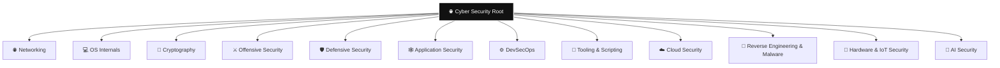

<div align="center">

# 🕵️‍♂️ Crook2Root

### A zero-to-mastery cybersecurity knowledge base — engineered as a strict **12-Domain, multiple-trees** architecture.

*From `Crook` — an absolute novice fumbling in the dark — to `Root` — the master who owns the machine, the network, and their own tracks.*


</div>

---

## 🎯 The Vision

**Crook2Root** is not a pile of notes — it is a **deliberately engineered graph**. Most security wikis collapse into an unreadable hairball because every note links to every other note. Crook2Root rejects that. It is built as **twelve independent, colour-coded trees**, each a self-contained discipline, all hanging off a single Root:

```
🌐 Root  →  🗂️ Hub (Domain)  →  🌿 Branch (Sub-topic)  →  📄 Master Note (Deep dive)
```

Every note declares exactly **one** parent. There are **no lateral links between master notes** — only clean, vertical, four-level hierarchy. The result is a knowledge base you can *see*: open the Obsidian Graph View and twelve distinct, colour-separated constellations light up, each a domain you can master one branch at a time.

---

## 📖 What This Repository Is

This is the **public documentation repository**: pure learning material, written to take a reader from zero to mastery by reading.

Every technical note is a **room** read top to bottom. The opening section assumes nothing. Each section builds on the ones above it. By the last one you are looking at internals, edge cases and failure modes.

| ✅ What lives here | ❌ What does not |
|:--|:--|
| Complete technical explanation | Labs and exercises |
| **Worked examples** — real commands, real output, field-by-field interpretation | Practice questions and quizzes |
| Mermaid diagrams, tables, ASCII layouts | CTF challenges and flags |
| Failure modes and troubleshooting | Progress tracking and scoring |

> **The interactive platform is a separate, private repository.** It consumes this repo as its source of content and images, and adds the labs, per-room practice questions, and CTFs on top. This repo teaches; that one assesses. Keeping the boundary clean keeps both simple.

Difficulty is declared per note — `difficulty/easy`, `difficulty/medium`, `difficulty/hard`, and `difficulty/info` for navigation hubs — so a reader always knows what a room assumes.

---

## 🌳 The 12-Domain Architecture



| # | Domain | Colour | What lives here |
|:-:|:--|:--|:--|
| 01 | 🌐 **Networking** | `#42D4F4` Cyan | OSI/TCP-IP, addressing & subnetting, DNS/DHCP/NAT, routing, core protocols |
| 02 | 🐧 **OS Internals** | `#FFA500` Orange | The CLI arsenal, filesystem, permissions & processes, privilege escalation, Windows/AD internals |
| 03 | 🔐 **Cryptography** | `#FFE119` Yellow | Encoding vs encryption vs hashing, symmetric/asymmetric, signatures, TLS/JWT, cracking |
| 04 | ⚔️ **Offensive Security** | `#E6194B` Red | Methodology, recon, social engineering, exploitation, exploit dev, anti-forensics, CTF & stego |
| 05 | 🛡️ **Defensive Security** | `#4363D8` Blue | Controls & hardening, logging, EDR/SIEM, detection engineering |
| 06 | 🕸️ **Application Security** | `#911EB4` Purple | HTTP fundamentals, the OWASP Top 10, web exploitation, API defense |
| 07 | ⚙️ **DevSecOps** | `#3CB44B` Green | Containers, orchestration, secure delivery pipelines |
| 08 | 🧰 **Tooling & Scripting** | `#469990` Teal | Python & Go for security, the core pentest toolkit |
| 09 | ☁️ **Cloud Security** | `#FABED4` Pink | IAM, storage, workloads, cloud-native attack paths *(growing)* |
| 10 | 🦠 **Reverse Engineering & Malware** | `#BFEF45` Lime | Disassembly, debugging, malware analysis *(growing)* |
| 11 | 🔌 **Hardware & IoT Security** | `#9A6324` Brown | Firmware, embedded, radio, IoT *(growing)* |
| 12 | 🧠 **AI Security** | `#F032E6` Magenta | Prompt injection, model theft, data poisoning *(growing)* |

> Colours are wired into `.obsidian/graph.json` and applied automatically via per-domain `#tree/*` tags — **open the graph and the twelve trees are instantly colour-coded.**

---

## ⚙️ Real-World Application

This vault is academic and **written for practitioners**:

- **⚔️ Offensive research on bare-metal, native Linux.** The material assumes a real attack host — e.g. a **ThinkPad running BlackArch** — where native hardware access unlocks Wi-Fi monitor mode & injection, full-speed GPU hash cracking, and USB/SDR tooling that virtual machines cripple. Bare-metal isn't a preference here; it's a capability.
- **🏗️ Engineering secure backends & architectures.** The DevSecOps, Application Security, Cryptography, and Tooling trees are written for builders — hardening containers, choosing the right KDF, defending APIs, and designing systems that survive the very attacks documented in the offensive trees.

Offense and defense are two views of one skill: **every offensive technique is paired with how it is detected and defeated.**

---

## 🚀 How to Use

This is an **Obsidian vault**. To get the full experience — the interlinked graph and the automatic colours:

```bash
# 1. Clone the repository
git clone https://github.com/s4l1hs/cybersec-crook2root-notes.git

# 2. Open Obsidian → "Open folder as vault" → select the cloned folder
```

3. Open the **Graph View** (`Ctrl/Cmd + G`).
4. The **twelve domains render in their distinct colours automatically** (config ships in `.obsidian/`).
5. Start at **`Cyber Security`** and explore a tree, or dive straight into a domain hub.

> 💡 **Tip:** If colours don't appear immediately, fully **quit and reopen** Obsidian once so it loads `.obsidian/graph.json`.

**Navigation model:** `Root → Hub → Branch → Master Note`. Pick a domain, follow a branch, go deep. The graph is your map.

---

## 📊 At a Glance

| | |
|:--|:--|
| 🗂️ **Domains** | 12 colour-coded trees |
| 🌿 **Structure** | Root → Hub → Branch → Master (4 levels, strictly hierarchical) |
| 📄 **Notes** | 392 Markdown notes · 307 technical leaves |
| 🧩 **Format** | Progressive sections per room, worked examples, per-note difficulty |
| 🖼️ **Visuals** | Mermaid only — diffable, theme-aware, zero binary assets |
| 🔗 **Integrity** | 0 broken links · 0 broken anchors · 0 broken images |

---

## ⚖️ Ethics & Authorized Use

Crook2Root documents offensive techniques **so they can be understood, detected, and defended against.** Everything here is for **authorized engagements, CTFs, personal labs, and defensive research** on systems you own or are explicitly permitted to test. Using these techniques against systems without permission is illegal. **Learn to attack so you can build the unbreakable.**

---

## 🤝 Contributing

Crook2Root is designed to grow with the community. The four newest domains — **Cloud Security, Reverse Engineering & Malware, Hardware & IoT, and AI Security** — are live scaffolds ready for their first branches. Contributions that respect the architecture are welcome:

1. One note = one topic; give it a single parent (`Domain:` frontmatter).
2. Tag it with its domain's `#tree/*` tag so it inherits the colour, plus one `difficulty/*` tag.
3. **No lateral links between master notes** — reference other topics in **bold**, not `[[wikilinks]]`.
4. Structure content as plain `## Descriptive Title` sections in teaching order, ending with a `## Summary`.
5. Teach with **worked examples** — real commands and their real output. No labs, no questions, no flags; those belong in the website repo.

Read the complete [Contribution Guide](CONTRIBUTION.md) and [Crook2Root Authoring Standard](docs/Crook2Root%20Authoring%20Standard.md) before opening a pull request.

---

<div align="center">

**Twelve trees. One root. Crook → Root.**

</div>
