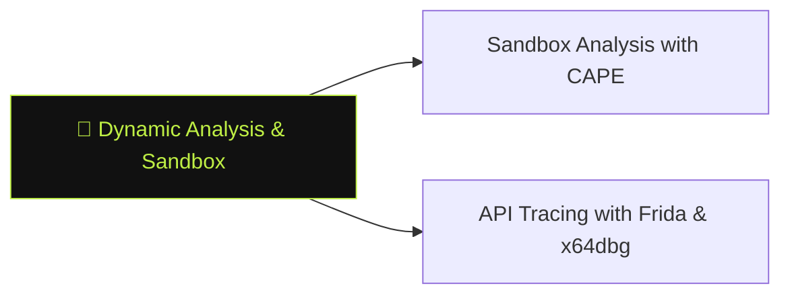

# 🏃 Dynamic Analysis & Sandbox

> [!abstract] The Branch
> Running a malware sample in an instrumented environment reveals runtime behaviour — API calls, network connections, registry modifications, and decrypted strings — that static obfuscation conceals.

## Learning Path

1. [[Sandbox Analysis with CAPE]] — automated behavioural report; YARA signatures; network PCAP extraction from detonation
2. [[API Tracing with Frida & x64dbg]] — hooking WinAPI calls at runtime; breakpointing decryption routines; dumping unpacked payloads

> [!note] Planned notes
> Content notes for this branch are coming soon.

---
> 🔼 Up: [[Reverse Engineering & Malware]]
