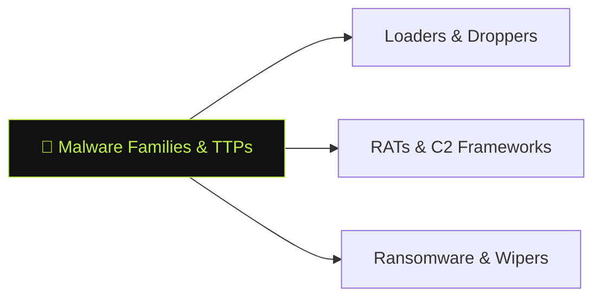

# 🧬 Malware Families & TTPs

> [!abstract] The Branch
> Understanding malware families — their loaders, persistence mechanisms, C2 protocols, and evasion techniques — allows analysts to pivot from a single sample to an entire campaign.

## Learning Path

1. [[Loaders & Droppers]] — staged execution; process injection (shellcode, DLL injection, process hollowing); packing and obfuscation
2. [[RATs & C2 Frameworks]] — Cobalt Strike, Sliver, Havoc beacon anatomy; malleable C2 profiles; JA3/JA3S fingerprinting
3. [[Ransomware & Wipers]] — file encryption patterns; shadow copy deletion; exfiltration before encryption; attribution artifacts

> [!note] Planned notes
> Content notes for this branch are coming soon.

---
> 🔼 Up: [[Reverse Engineering & Malware]]
