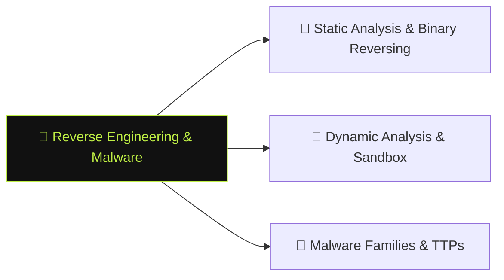

# 🦠 Reverse Engineering & Malware

> [!abstract] The Domain
> Taking binaries apart — PE structure, disassembly, decompilation, sandbox analysis, and understanding how malware families achieve persistence, evasion, and C2. Part of the domain map at [[Cyber Security]].

## Learning Path

1. [[Static Analysis & Binary Reversing]] — PE structure, imports, Ghidra decompilation; string and API-call hunting without executing the sample
2. [[Dynamic Analysis & Sandbox]] — controlled execution in Cuckoo/CAPE; API tracing with Frida; network and registry monitoring
3. [[Malware Families & TTPs]] — loaders, RATs, ransomware and rootkits mapped to ATT&CK; identifying family signatures

---
> 🌐 Back to the domain map: [[Cyber Security]]
