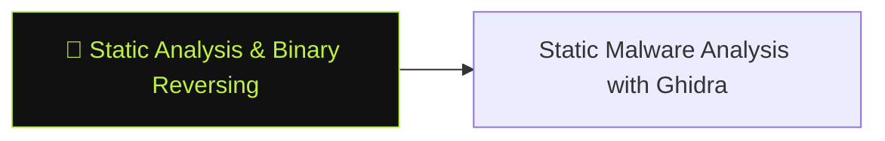

# 🔬 Static Analysis & Binary Reversing

> [!abstract] The Branch
> Static analysis examines a binary without executing it — safe for unknown malware, and the right starting point before dynamic analysis reveals what you should look for.

## Learning Path

1. [[Static Malware Analysis with Ghidra]] — PE header triage, import analysis, Ghidra auto-analysis, decompiler-guided code reading

---
> 🔼 Up: [[Reverse Engineering & Malware]]
