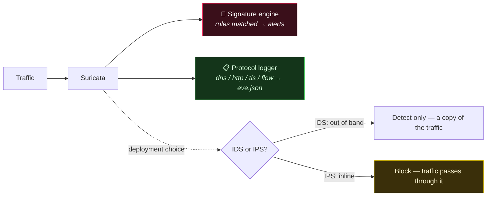

# Suricata

> [!abstract] Note of [[Network Detection & Monitoring Tools]]
> Suricata is the hybrid sensor: a multi-threaded engine that runs Snort-compatible signatures *and* emits Zeek-style protocol metadata into `eve.json`, deployable passively as an IDS or inline as an IPS.

Suricata is the modern, multi-threaded network IDS/IPS. It runs signature rules (Snort-compatible) at high throughput, and — unlike a pure signature engine — *also* logs protocol metadata (like Zeek does) into `eve.json`. It can run passively (IDS: detect) or inline (IPS: block), which makes it the hybrid that sits between the two models in this category.

> [!warning] Inline mode can break traffic
> In IPS mode Suricata drops packets. A bad rule then blocks legitimate traffic — test rules in IDS mode first, and change deployment mode deliberately.

## Parent Learning Order
Suricata -> Snort -> Zeek

**Prerequisites:** TCP/IP and the idea of a flow with a direction. [[Snort]]'s rule grammar transfers directly — Suricata reads the same syntax.

## One engine doing both signatures and protocol logging

> *You are handed Suricata output. Which of its three hats produced it?*
>
> Hold your answer — the section below is the response.

There are two ways to watch a network; Suricata is unusual in doing *both*.

Suricata wears three hats at once, and knowing which one a given deployment is
using is the key to reading its output:



On the left it is a **signature engine** — matching traffic against known-bad
rules and alerting, exactly as Snort does. But it simultaneously emits structured
**protocol logs** (`dns`, `http`, `tls`, `flow`) into `eve.json`, which is Zeek's
job rather than Snort's. And the dotted branch is a deployment decision, not a
feature: **IDS** sees a copy of the traffic and can only report, while **IPS**
sits in the path and can drop — which is also why an over-broad rule is a noisy
alert in one mode and an outage in the other.

## Snort grammar in, eve.json out

Rules use the same grammar as Snort; output lands in `eve.json` (one JSON event per line, SIEM-ready):

```shell-session
analyst@sensor:~$ suricata -c /etc/suricata/suricata.yaml -i eth0
analyst@sensor:~$ tail -f /var/log/suricata/eve.json | jq 'select(.event_type=="alert")'
{ "alert": { "signature": "ET MALWARE Cobalt Strike Beacon", "severity": 1 },
  "src_ip": "10.10.10.14", "dest_ip": "198.51.100.9", "dest_port": 443 }
```

A rule reads left to right — *action, protocol, source → destination, then options*:

```text
alert tls any any -> any any (msg:"Self-signed cert to external"; tls.cert_self_signed; sid:100001;)
```

`suricata-update` pulls community rule sets (Emerging Threats); `eve.json` event types (`alert`, `dns`, `http`, `tls`, `flow`) feed a SIEM directly.

## The rule is fine; the flow was never established

Every app-layer keyword — `http.user_agent`, `tls.sni`, `dns.query` — depends on Suricata having *parsed the protocol*, and it will only do that for a flow whose setup it witnessed. By default `stream.midstream` is `false`: if the sensor did not see the three-way handshake, the TCP session is tracked but never reassembled into an application stream, so no app-layer buffer exists and no app-layer rule can match. Three rules, one capture, run twice with only that setting changed:

```shell-session
analyst@sensor:~$ suricata -c suricata.yaml -r meridian.pcap -l log/     # default
{"sig":"Lookup of known C2 domain","src":"10.10.10.14","dst":"10.10.20.10","proto":"dns"}

analyst@sensor:~$ # stream.midstream: true, same rules, same pcap
{"sig":"Lookup of known C2 domain","src":"10.10.10.14","dst":"10.10.20.10","proto":"dns"}
{"sig":"Non-browser user agent to tracking app","src":"10.10.10.14","dst":"203.0.113.20","proto":"http"}
{"sig":"SNI matches C2 domain","src":"10.10.10.14","dst":"198.51.100.9","proto":"tls"}
```

The DNS rule fires in both runs because it rides on UDP, which has no handshake to miss. The HTTP and TLS rules are silent in the first — not wrong, not misconfigured, simply matching against a buffer that was never built. Nothing in the output says so.

This is the failure mode that costs days, because it looks exactly like a bad rule. Its causes are all about sensor placement rather than rule text: a sensor restarted mid-session, a span port that only carries one direction of an asymmetrically-routed flow, a load balancer that hashes the two directions to different links, or simply a long-lived connection that opened before the sensor did. `suricata -T -c suricata.yaml` validates config and rules, and `stats.log` reports reassembly gaps and `capture.kernel_drops` — read both before concluding a rule is broken.

## Where IDS mode becomes an outage

The IDS-vs-IPS decision is where Suricata can go from *helpful* to *outage*:

```text
# IDS mode (af-packet, out-of-band on a tap) — a false-positive rule just ALERTS
[alert] ET rule 2019... matched  → analyst reviews, no user impact

# IPS mode (inline, NFQUEUE/af-packet inline) — the SAME false-positive rule DROPS
alert → drop   → legitimate connections to a partner API now BLOCKED for everyone
```

**The deliberate break:** a slightly over-broad rule is a minor annoyance in IDS mode (one noisy alert to tune) but a **self-inflicted denial of service** in IPS mode, because inline Suricata *acts* on every match by dropping the packet. The same rule set, two deployment modes, wildly different blast radius. The discipline: develop and tune rules in **IDS mode** against real traffic, measure the false-positive rate, and only promote to inline **IPS** rules you trust — and even then keep a bypass. The other Root reality (shared with Snort): **content signatures can't see inside TLS**, so a growing share of Suricata's value is its *metadata* logging (JA3 fingerprints, SNI, cert anomalies) rather than payload rules — which is exactly the ground Zeek was built for.

**How you'd spot it:** establish which mode produced the output before you read a line of it: `drop` actions in the rule set and an NFQUEUE argument in the service definition mean inline. In IPS mode an over-broad rule does not announce itself as a noisy alert — it appears as an application that stopped working for some users at the exact moment the rule set was deployed.

## Security Implications

Suricata's value grows as payload inspection shrinks, and the reason is TLS. A content rule cannot see inside an encrypted session, so the durable signal moves to metadata the handshake still exposes in clear: the SNI, the certificate, and the **JA3** fingerprint — a hash over the client's TLS version, cipher list, extensions, curves and point formats, in the order the client offered them. That ordering is a property of the *implementation*, not the destination, so a beacon written against a bespoke TLS stack fingerprints differently from every browser on the network even when its destination is a legitimate CDN. Malware families that use a common library have moved to imitating browser fingerprints exactly, which is why JA3 is a strong hunting signal and a weak blocking one.

The sensor is also an asset worth attacking. Suricata parses hostile input by design, so its decoders and app-layer parsers are the highest-risk code in the deployment, and a sensor sits on a span port with visibility into everything — the best position on the network for anyone who takes it. Keep the management interface off the monitored segment, run the capture interface without an address, and patch the engine as you would a public-facing service.

Inline mode adds a second exposure: it is a control-plane chokepoint. An attacker who can force Suricata into an expensive path — pathological reassembly, a flood of tiny fragments — degrades throughput for everyone behind it, converting a detection failure into an availability one. The mitigating design is the same in both directions: measure `capture.kernel_drops` continuously, because a sensor dropping packets reports no alerts in exactly the way a healthy quiet network does.

## Summary

You should now be able to:

- Name the three roles Suricata can operate in, and explain how it differs from a pure signature IDS.
- Read a Suricata rule's structure, and name the output that feeds a SIEM.
- Explain why an app-layer rule silently cannot match on a flow whose handshake the sensor missed, and where to look before blaming the rule.
- Explain why the same rule is safe in IDS mode but dangerous in IPS mode, why JA3 hunts well and blocks badly, and what a rising kernel-drop count does to your alert volume.

---
> 🔼 Up: [[Network Detection & Monitoring Tools]]
