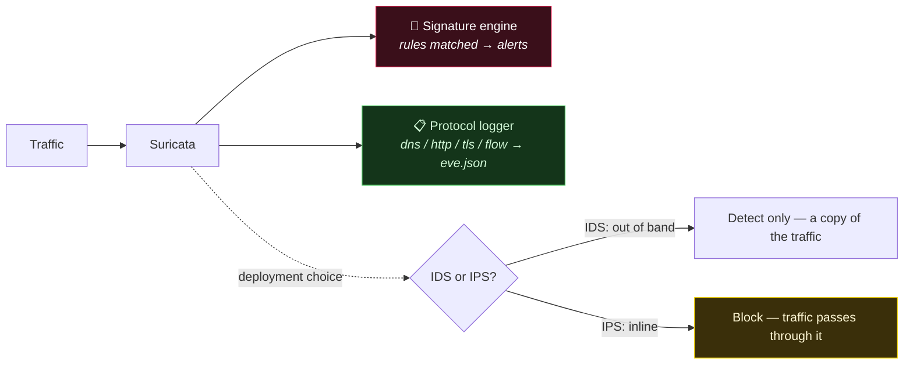

# Suricata

Suricata is the modern, multi-threaded network IDS/IPS. It runs signature rules (Snort-compatible) at high throughput, and — unlike a pure signature engine — *also* logs protocol metadata (like Zeek does) into `eve.json`. It can run passively (IDS: detect) or inline (IPS: block), which makes it the hybrid that sits between the two models in this category.

> [!warning] Inline mode can break traffic
> In IPS mode Suricata drops packets. A bad rule then blocks legitimate traffic — test rules in IDS mode first, and change deployment mode deliberately.

## Parent Learning Order
Suricata -> Snort -> Zeek

## One engine doing both signatures and protocol logging

There are two ways to watch a network; Suricata is unusual in doing *both*.

Suricata wears three hats at once, and knowing which one a given deployment is
using is the key to reading its output:



On the left it is a **signature engine** — matching traffic against known-bad
rules and alerting, exactly as Snort does. But it simultaneously emits structured
**protocol logs** (`dns`, `http`, `tls`, `flow`) into `eve.json`, which is Zeek's
job rather than Snort's. And the dotted branch is a deployment decision, not a
feature: **IDS** sees a copy of the traffic and can only report, while **IPS**
sits in the path and can drop — which is also why an over-broad rule is a noisy
alert in one mode and an outage in the other.

## Snort grammar in, eve.json out

Rules use the same grammar as Snort; output lands in `eve.json` (one JSON event per line, SIEM-ready):

```shell-session
analyst@sensor:~$ suricata -c /etc/suricata/suricata.yaml -i eth0
analyst@sensor:~$ tail -f /var/log/suricata/eve.json | jq 'select(.event_type=="alert")'
{ "alert": { "signature": "ET MALWARE Cobalt Strike Beacon", "severity": 1 },
  "src_ip": "10.10.10.44", "dest_ip": "203.0.113.9", "dest_port": 443 }
```

A rule reads left to right — *action, protocol, source → destination, then options*:

```text
alert tls any any -> any any (msg:"Self-signed cert to external"; tls.cert_self_signed; sid:100001;)
```

`suricata-update` pulls community rule sets (Emerging Threats); `eve.json` event types (`alert`, `dns`, `http`, `tls`, `flow`) feed a SIEM directly.

## Where IDS mode becomes an outage

The IDS-vs-IPS decision is where Suricata can go from *helpful* to *outage*:

```text
# IDS mode (af-packet, out-of-band on a tap) — a false-positive rule just ALERTS
[alert] ET rule 2019... matched  → analyst reviews, no user impact

# IPS mode (inline, NFQUEUE/af-packet inline) — the SAME false-positive rule DROPS
alert → drop   → legitimate connections to a partner API now BLOCKED for everyone
```

**The deliberate break:** a slightly over-broad rule is a minor annoyance in IDS mode (one noisy alert to tune) but a **self-inflicted denial of service** in IPS mode, because inline Suricata *acts* on every match by dropping the packet. The same rule set, two deployment modes, wildly different blast radius. The discipline: develop and tune rules in **IDS mode** against real traffic, measure the false-positive rate, and only promote to inline **IPS** rules you trust — and even then keep a bypass. The other Root reality (shared with Snort): **content signatures can't see inside TLS**, so a growing share of Suricata's value is its *metadata* logging (JA3 fingerprints, SNI, cert anomalies) rather than payload rules — which is exactly the ground Zeek was built for.

## Summary

You should now be able to:

- Name the three roles Suricata can operate in, and explain how it differs from a pure signature IDS.
- Read a Suricata rule's structure, and name the output that feeds a SIEM.
- Explain why the same rule is safe in IDS mode but dangerous in IPS mode, and what that implies for rollout.

---
> 🔼 Up: [[Network Detection & Monitoring Tools]]
