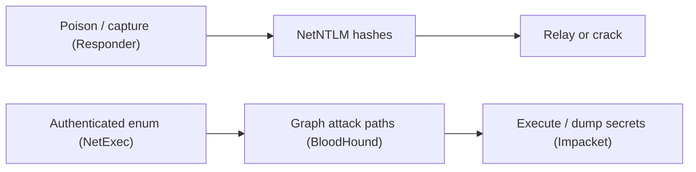

# Active Directory & Windows Attack Tools

> [!warning] Authorized operations only
> These tools operate against domain identities and authentication protocols. Use only inside an authorized engagement with a scoped domain, and prefer a purpose-built lab (e.g. GOAD or a throwaway domain) over any production directory.

Active Directory is the identity backbone of most enterprises, and its attack surface is *protocol* rather than *port*: NTLM and Kerberos, LDAP, SMB, and the trust relationships between them. This category holds the instruments that enumerate those relationships, capture and relay authentication, and map the paths from a low-privileged foothold to Domain Admin.



## Tools in this category

- [[Impacket]]
- [[NetExec]]
- [[BloodHound]]
- [[Responder]]

```text
Capture identity -> enumerate the domain -> graph the shortest path to DA -> execute/collect under scope
```

The techniques these tools automate are taught in **Offensive Security → Active Directory & Identity Exploitation**; this branch documents the instruments themselves.

---
> 🔼 Up: [[Offensive Tools]]
