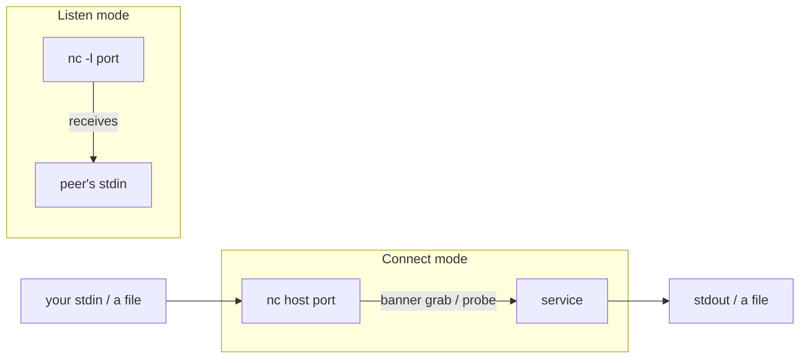

# Netcat

Netcat reads and writes raw byte streams over TCP or UDP — nothing more, and that is exactly why it is the "TCP/IP Swiss army knife." One tiny program does connectivity checks, banner grabbing, hand-built protocol exchanges, lab listeners, and file transfer. Implementations differ (OpenBSD `nc`, traditional Netcat, Ncat, BusyBox), so flags vary.

> [!warning] Authorized use only
> Netcat has no encryption, authentication, or integrity. Never move secrets with it, and never expose an unauthenticated shell listener — some legacy `-e` builds execute programs (instant RCE risk).

## Parent Learning Order
Gobuster -> ffuf -> feroxbuster -> dirsearch -> Netcat -> enum4linux

## Connecting two byte streams

> *Netcat does port scanning, file transfer, banner grabbing and reverse shells. How many mechanisms is that?*
>
> Hold your answer — the section below is the response.

Everything Netcat does is "connect two byte streams." One side **listens** (`-l`), the other **connects**; then stdin on one end appears on the other's stdout. Every use is a variation on that pipe.



Once you see it as a pipe, the "modes" are obvious: aim stdin at a socket to *send* (probe, transfer); read stdout to *receive*; put a listener on one end for a reverse channel.

## Banner grabs, listeners, and file transfer

**Connectivity + banner grab** — is the port open, and what's behind it?

```shell-session
operator@lab:~$ nc -nvz -w 2 192.0.2.10 22 443
Connection to 192.0.2.10 22 port [tcp/*] succeeded!
operator@lab:~$ printf 'HEAD / HTTP/1.1\r\nHost: app.example.test\r\nConnection: close\r\n\r\n' | nc -nv 192.0.2.10 80
HTTP/1.1 301 Moved Permanently
Location: https://app.example.test/
```

**Lab listener + file transfer** (isolated range only — hash both ends, since Netcat proves nothing about integrity):

```shell-session
receiver$ nc -l 9001 > received.bin
sender$   nc -N 192.0.2.20 9001 < canary.bin
receiver$ sha256sum received.bin
3f91...  received.bin
```

Core flags: `-l` listen, `-n` no DNS, `-v` verbose, `-z` zero-I/O scan, `-w` timeout, `-u` UDP, `-k` keep listener open (where supported), `--ssl` (Ncat only).

**Catching a reverse shell — `rlwrap` and the TTY upgrade.** The most common Netcat job in an assessment is *receiving* a reverse shell (see **revshells.com**). A bare `nc -lvnp 4444` catches the connection, but the resulting shell is **dumb**: no command history, no arrow keys, no tab-completion, and `Ctrl-C` kills the whole session. Two fixes, in order of effort:

```shell-session
# 1) rlwrap — wrap the listener with readline: arrow keys, history, line editing
attacker$ rlwrap nc -lvnp 4444
Connection received on 10.10.20.20 51234
$ (now Up-arrow recalls commands, Left/Right edit the line)
```

```shell-session
# 2) Full TTY upgrade — turns the dumb shell into a real terminal
victim$ python3 -c 'import pty;pty.spawn("/bin/bash")'   # spawn a PTY
# then background with Ctrl-Z, and on the attacker:
attacker$ stty raw -echo; fg                              # hand the terminal to nc
victim$ export TERM=xterm; stty rows 40 cols 160          # fix size + termcap
victim$ sudo -l                                           # prompts now work
[sudo] password for www-data:
```

`rlwrap` fixes *editing* on your side; the PTY upgrade fixes *everything* (job control, `sudo`/`ssh`/`vim` prompts, `Ctrl-C` only killing the foreground command). For a fully interactive shell from the start, `socat` beats Netcat: `socat file:$(tty),raw,echo=0 tcp-listen:4444` on the attacker, paired with a `socat` reverse payload, delivers a real TTY with no manual upgrade.

## The framing that higher-level clients hide

Netcat exposes the framing that higher-level clients hide — line endings, half-close, and timeouts — which is why it is the best tool for learning a protocol by hand:

```shell-session
operator@lab:~$ printf 'EHLO test\r\nQUIT\r\n' | nc -nv -w 3 192.0.2.25 25
220 mail.example.test ESMTP
250-mail.example.test
221 Bye
operator@lab:~$ nc -nvz -w 2 192.0.2.10 53      # UDP "scan" — beware
Connection to 192.0.2.10 53 port [udp/*] succeeded!
```

**The deliberate break:** that UDP "succeeded" is a **lie**. UDP is connectionless — `nc -z` reports success simply because *no ICMP error came back*, which also happens when a firewall silently drops the probe or the packet is lost. Unlike the TCP handshake (which proves the port is open), UDP silence is ambiguous exactly like Nmap's `open|filtered`. To actually confirm a UDP service you must send an application-layer payload it will answer and capture the reply — `nc -z` alone produces false positives. Netcat's honesty about *bytes* is also its honesty about *uncertainty*.

Defensively, raw listeners, odd outbound destinations, and plaintext probes show up cleanly in endpoint socket telemetry and firewall flows — Netcat is loud, which is why real operators reach for TLS-aware Ncat or SSH when confidentiality matters.

## Summary

You should now be able to:

- Explain why Netcat is described as a pipe between two byte streams.
- You catch a raw reverse shell but arrow keys and `sudo` fail. Upgrade it to a full TTY, and explain what `rlwrap` fixes versus a PTY spawn.
- Explain why `nc -uz` can falsely report a UDP port open, and how you'd truly confirm it.

---
> 🔼 Up: [[Enumeration & Service Interaction Tools]]
