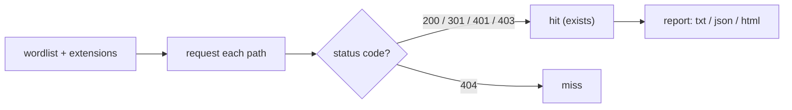

# dirsearch

dirsearch is a Python web-path brute-forcer built for **convenience out of the box**: a strong bundled wordlist, smart extension handling, and clean reports mean you can point it at a target and get useful results with almost no configuration. Where Gobuster prizes raw speed and feroxbuster prizes recursion, dirsearch prizes a sensible default experience — making it a common first content-discovery pass.

> [!warning] Authorized targets only
> Brute-forcing paths generates thousands of requests. Scope the target, throttle where needed, and expect to appear in logs.

## Parent Learning Order
Gobuster -> ffuf -> feroxbuster -> dirsearch -> Netcat -> enum4linux

## Asking for thousands of paths and watching the codes

> *You request `/admin` and the server answers `200`. Does `/admin` exist?*
>
> Hold your answer — the section below is the response.

A web server only tells you about the URLs you ask for. **Content discovery** means asking for thousands of likely paths (`/admin`, `/backup`, `/.git/`, `/api/v1`) and watching the HTTP status code to infer what exists — a `200` or `301` is a hit, a `404` is a miss. The whole game is a good wordlist and correctly *reading the status codes*.

dirsearch prints the status and size for every hit; the diagram is how you read them — including the soft-404 trap it can auto-detect but you must confirm.



dirsearch's edge for a beginner: it ships with a curated `db/dictionary.txt`, auto-expands `%EXT%` placeholders per file type, and filters noise by default — so a first run is productive without tuning.

## The -e extension expansion

The signature move is the `-e` extension expansion: dirsearch takes wordlist entries containing `%EXT%` and tries each extension you list.

```shell-session
operator@lab:~$ dirsearch -u http://track.meridian.test -e php,bak,txt
[10:14:02] Target: http://track.meridian.test/
[10:14:05] 301 -   0B - /admin  ->  /admin/
[10:14:07] 200 - 1KB - /admin/login.php
[10:14:09] 200 - 4KB - /config.php.bak
[10:14:10] 403 -  15B - /server-status
[10:14:12] 200 - 90B - /.git/HEAD
Task Completed  |  hits: 5
```

Every line is a lead with meaning: `403` on `/server-status` means it *exists but is forbidden* (still a finding); `/.git/HEAD` returning `200` is a source-code-exposure jackpot; `/config.php.bak` is a leaked backup. Useful flags:

| Flag | Does |
|---|---|
| `-e` | extensions to append (`php,bak,txt`) |
| `-w` | custom wordlist (default is bundled) |
| `-r` | recursive (dig into found directories) |
| `-x` | exclude status codes (`-x 403,500`) |
| `-i` | include only these statuses |
| `-t` | threads |
| `--format` / `-o` | report format (json/html/csv) + output file |

## When a fixed-size 200 masquerades as a hit

dirsearch decides "exists vs. not" from the status code, which a misconfigured server can weaponise against you:

```shell-session
operator@lab:~$ dirsearch -u http://track.meridian.test -e php
[10:20:01] 200 - 1KB - /admin/login.php
[10:20:02] 200 - 512B - /totally-random-xyz.php
[10:20:02] 200 - 512B - /also-not-real.php     ← everything is 200?!
operator@lab:~$ dirsearch -u http://track.meridian.test -e php --exclude-sizes 512B
[10:20:40] 200 - 1KB - /admin/login.php
```

**The deliberate break:** the app returns `200` with a fixed 512-byte "page not found" body for *every* path (a **soft-404**), so the first run is all false positives. dirsearch can't infer truth from the status code because the server lies — you must filter by the constant response size (`--exclude-sizes`) or content. Recognising soft-404s is the single most important content-discovery skill; the tool's convenience is worthless without it.

**How you'd spot it:** the same calibration every content-discovery tool needs, and it is not optional. Request two paths that cannot exist and compare: matching status *and* matching length means the server lies about 404s. In a finished run the give-away is a results table whose size column holds the same number all the way down.

Deeper internals: dirsearch auto-detects some wildcard/soft-404 behaviour and warns, but not all; it normalises trailing-slash handling; and its `-r` recursion (like feroxbuster's) can explode request counts, so cap depth on large sites. For evidence, always emit a machine-readable report (`--format json`) rather than scraping the console — the JSON preserves status, size, and redirect target for the finding record.

## Security Implications

**Its bundled wordlist is its fingerprint.** dirsearch's default dictionary requests a recognisable sequence of sensitive paths — `.git/HEAD`, `.env`, `*.bak`, `config.php.bak`, `/admin` — so a defender does not even need request-rate to spot it: a burst of requests for exactly those high-value files, in that order, from one source is a dirsearch run. A WAF rule matching requests for VCS and backup paths catches it and catches the exposure it is hunting for at once.

**The jackpots it finds are configuration failures, not tool cleverness.** `/.git/HEAD` returning `200` is source-code disclosure; `config.php.bak` is a leaked secret; `/server-status` is an information leak. Each is a file that should never have been web-reachable, and each belongs in the report as a server-hygiene finding — removing them is the fix, not blocking the scanner.

**Recursion multiplies load and exposure.** Like feroxbuster, `-r` on a large site explodes the request count, so cap depth and emit a machine-readable report (`--format json`) that preserves status, size and redirect target as evidence rather than scraping the console.

All discovery here targets only authorised scope; the run is logged and attributable.

## Summary

You should now be able to:

- Explain how a content-discovery tool infers that a path exists without being given a list.
- Judge whether a `403` on `/server-status` from dirsearch is a finding, and explain why.
- Every path returns `200`. Explain what the server is doing and the two ways you recover the real hits.

---
> 🔼 Up: [[Enumeration & Service Interaction Tools]]
