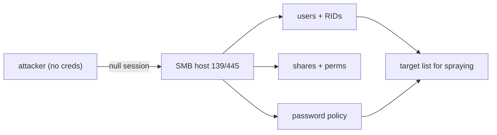

# enum4linux

enum4linux (and its rewrite `enum4linux-ng`) wraps the Samba client tools to harvest everything an SMB/Windows host will reveal — often through an **anonymous "null session."** Users, groups, shares, the password policy, and OS details can leak with no credentials at all, which makes it the go-to first move against ports 139/445 on an internal engagement.

> [!warning] Authorized internal testing only
> The user and policy data it exposes is sensitive engagement evidence. Aim it only at SMB services you are authorized to assess.

## Parent Learning Order
Gobuster -> ffuf -> feroxbuster -> dirsearch -> Netcat -> enum4linux

## SMB defaults built to be helpful

Windows file sharing (SMB) was built to be *helpful*: legacy defaults let an **anonymous** client — a "null session," empty username and password — ask "who are your users? what do you share? what's your password policy?" and get answers. enum4linux automates every one of those questions.



The mental model: SMB is a chatty service, and enum4linux is the megaphone that makes it repeat everything it will tell an unauthenticated stranger.

## What a null session hands you

```shell-session
operator@lab:~$ enum4linux-ng -A 10.10.20.20
[+] Got domain/workgroup name: CORP
[+] Server allows session using username '', password ''  (null session!)
=== Users ===   svc_backup (RID 0x3e9),  jdoe (RID 0x3ea)
=== Shares ===  backup$   READ    (accessible with null session)
=== Password policy ===  Minimum length: 7   Lockout threshold: none
```

The gold: a null session leaked the user list **and** a policy with **no lockout threshold** — meaning a downstream password spray (see **NetExec**) can run without locking accounts. That one line reshapes the engagement. When direct enumeration is blocked, **RID cycling** walks the SID space to recover accounts anyway (`-R 500-1050`).

## One registry value, two completely different answers

```shell-session
operator@lab:~$ enum4linux-ng -U 10.10.20.20       # legacy/misconfigured
[+] Server allows session using username '', password ''
users: svc_backup, jdoe, intern
operator@lab:~$ enum4linux-ng -U 10.10.20.99       # hardened host
[-] Could not establish null session: STATUS_ACCESS_DENIED
[-] No users enumerated
```

**The deliberate break:** the same command yields a full user directory on one host and `STATUS_ACCESS_DENIED` on another. The only difference is a single setting — `RestrictAnonymous` / `RestrictNullSessAccess`. That contrast *is* the finding: a `STATUS_ACCESS_DENIED` here is evidence of **good** hygiene, not tool failure. A tester who reports "enum4linux failed" instead of "null sessions are correctly restricted" has misread the result.

Internals: `enum4linux-ng` speaks more protocols and outputs JSON (better than the legacy Perl script); RID cycling is slow over wide ranges, so bound it around known RIDs (500–1500); and an empty share list with a populated user list means anonymous can enumerate accounts but not shares — note the *exact* anonymous exposure, not a blanket "SMB is open."

## Summary

You should now be able to:

- Define a "null session" and explain why SMB allows it.
- Shape the next step from a single enum4linux fact — "lockout threshold: none".
- Explain why a `STATUS_ACCESS_DENIED` result is itself a finding, and which setting produces it.

---
> 🔼 Up: [[Enumeration & Service Interaction Tools]]
