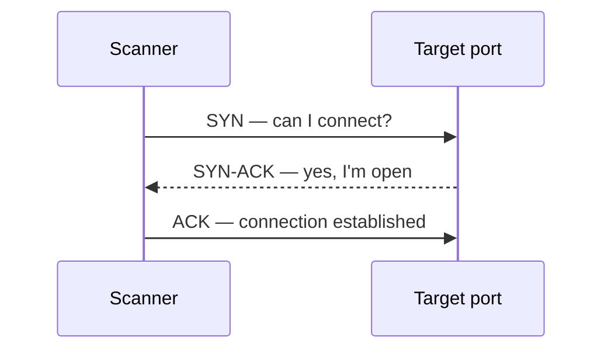

# Nmap

> [!abstract] Note of [[Network Discovery Tools]]
> Nmap never sees an open port — it infers state from a reply or from silence, and the whole tool is that inference plus three fingerprinting engines built on top of it. This note covers why a SYN scan needs root (it bypasses the kernel's own TCP stack), how version, OS and NSE detection actually decide what they report, and the fan-out a scan leaves in a defender's logs.

Nmap is a network-discovery, port-state inference, service-fingerprinting, and scriptable enumeration platform. Its output is *evidence about packets and responses* — not proof of vulnerability. It is the single most important tool in an assessor's kit, and learning it well means learning how the network answers a probe.

> [!warning] Scope first
> Scan only approved addresses and rates. Use reserved examples such as `192.0.2.0/24` in documentation; replace them only with an engagement allowlist.

## Parent Learning Order
Nmap -> Masscan -> RustScan

## Inferring state from a reply, or from silence

> *Does a port scanner ever actually see an open port?*
>
> Hold your answer — the section below is the response.

A scanner never "sees" an open port. It sends a probe and **infers** the port's state from the reply — or from silence. The whole tool rests on the TCP handshake and a small set of possible responses.



The possible replies, and what each scan type infers from them:

| Scan | reply = OPEN | reply = CLOSED | silence means |
|:--|:--|:--|:--|
| SYN `-sS` (half-open) | `SYN-ACK` | `RST` | filtered |
| Connect `-sT` (full) | handshake completes | `RST` | filtered |
| UDP `-sU` | a UDP reply | `ICMP port-unreachable` | `open`&#124;`filtered` |

`filtered` and `open|filtered` are the genuinely hard results, because silence is
ambiguous — a firewall dropping the probe is indistinguishable from a lost
packet. That is why UDP scanning is slow and uncertain, and why a surprising
state always needs a second technique to confirm. `-sS` sends `RST` instead of
the final `ACK`, so the connection never completes and the application never logs
a session; `-sT` needs no privileges but completes the handshake, and the
application sees it.

**Prerequisites:** the TCP three-way handshake and flags, ICMP, and the difference between a raw socket and an OS `connect()`.

> [!tip] The analogy, and where it breaks
> Knocking on doors and listening: a knock answered is open, a "go away" is closed, and no answer at all is the ambiguous case. The analogy breaks on that silence — a person who does not answer is usually in or out, but a filtered port's silence is deliberately manufactured by a firewall standing in front of the door, so "no answer" is itself a finding rather than an absence of one.

## The flags you actually use, grouped by phase

**Install and verify** — record the version, because bundled NSE scripts change behaviour:

```shell-session
operator@lab:~$ sudo apt install nmap
operator@lab:~$ nmap --version | head -n 2
Nmap version 7.95 ( https://nmap.org )
Platform: x86_64-pc-linux-gnu
```

Nmap has a large flag surface; these are the ones you actually use, grouped by phase.

**Target specification** — *who* to scan:

| Flag | Meaning |
|---|---|
| `192.0.2.10`, `192.0.2.0/24`, `192.0.2.1-50` | single host · CIDR · range |
| `-iL targets.txt` | read targets from a file |
| `--exclude host` / `--excludefile f` | carve exclusions out of the range |
| `-sL` | list-scan: expand the target list, send *no* packets |

**Host discovery** — decide which hosts are "up" *before* port-scanning:

| Flag | Meaning |
|---|---|
| `-sn` | ping sweep only — discover live hosts, **no** port scan |
| `-Pn` | **skip discovery, treat every host as up** — essential when hosts don't reply to ping (blocks the whole scan otherwise), but scans dead hosts too (slow) |
| `-PS22,80,443` / `-PA` / `-PU` | discovery via TCP SYN / TCP ACK / UDP probes to given ports |
| `-PE` / `-PP` / `-PM` | ICMP echo / timestamp / netmask discovery |
| `-n` | **never do DNS resolution** — faster, and avoids tipping off DNS logs |
| `-R` | force reverse-DNS even on down hosts |

> `-Pn` and `-n` are the two you'll reach for constantly. `-Pn` is "the host is firewalled against ping, scan it anyway" — it is **not** stealth. `-n` strips reverse-DNS latency and leakage.

**Port specification** — *which* ports:

| Flag | Meaning |
|---|---|
| `-p 22,80,443` | explicit list |
| `-p 1-1000` / `-p-` | a range / **all 65,535 ports** |
| `-F` | fast — top 100 ports only |
| `--top-ports 1000` | the N most common ports |
| `-p U:53,T:80` | mix UDP and TCP port sets |
| `-r` | scan ports sequentially (default is randomized) |
| `--exclude-ports` | skip specific ports |

**Scan techniques** — *how* to probe (map onto the diagram):

| Flag | Technique |
|---|---|
| `-sS` | TCP SYN "half-open" — fast, stealthier, needs root |
| `-sT` | TCP connect — no root, but the app logs the session |
| `-sU` | UDP — slow, ambiguous (`open\|filtered`) |
| `-sA` | ACK — maps firewall statefulness, not open ports |
| `-sN` / `-sF` / `-sX` | Null / FIN / Xmas — no-flag/odd-flag inference (evasion) |

**Service, OS & scripts** — turn a port into detail:

| Flag | Meaning |
|---|---|
| `-sV` | service/version detection · `--version-intensity 0-9` |
| `-O` | OS fingerprinting · `--osscan-guess` |
| `-A` | aggressive: `-sV -O` + default scripts + traceroute |
| `--script default,safe` / `--script vuln` | run NSE by category |
| `--script http-title --script-args k=v` | run a specific script with args |

**Timing & performance** — speed vs. stealth vs. accuracy:

| Flag | Meaning |
|---|---|
| `-T0`…`-T5` | templates: `T0` paranoid (IDS-evasion slow) → `T5` insane (fast, lossy); `T3` default, `T4` typical |
| `--min-rate` / `--max-rate N` | packets/sec floor/ceiling (prefer over `-T` for control) |
| `--scan-delay` / `--max-scan-delay` | pause between probes (dodge rate-limits) |
| `--host-timeout` | give up on a slow host |
| `--max-retries N` | retransmits before marking filtered |

**Firewall / IDS evasion** (RoE-approved only): `-f` / `--mtu` (fragment), `-D decoy1,decoy2,ME` (decoys), `-S src` (spoof source), `-g`/`--source-port 53` (source-port trust abuse), `--data-length`, `--spoof-mac`.

**Output & diagnostics** — always keep evidence:

| Flag | Meaning |
|---|---|
| `-oN`/`-oX`/`-oG file` | normal / **XML** / grepable |
| `-oA base` | write all three at once (do this every scan) |
| `-v`/`-vv`, `-d` | verbosity / debug |
| `--reason` | *why* Nmap decided each state (`syn-ack`, `no-response`) |
| `--open` | show only open ports |
| `--packet-trace` | dump every packet sent/received |
| `--resume out.gnmap` | resume an interrupted scan |

**Common invocations, decoded:**

```shell-session
# Host discovery only, no DNS, no port scan
operator@lab:~$ nmap -sn -n 192.0.2.0/24
# Full-port SYN scan of a firewalled host, with service detection + evidence
operator@lab:~$ sudo nmap -Pn -n -sS -sV -p- --min-rate 500 --reason 192.0.2.10 -oA evidence/full
# Fast top-100 look with default scripts
operator@lab:~$ nmap -F -sV --script default 192.0.2.10 -oA evidence/quick
```

Read that middle line as a sentence: *don't ping first* (`-Pn`), *don't resolve DNS* (`-n`), *half-open* (`-sS`), *fingerprint versions* (`-sV`), *every port* (`-p-`), *at ≥500 pkt/s* (`--min-rate`), *show me why* (`--reason`), *save everything* (`-oA`).

## Why -sS and -sT are a detection choice

The difference between `-sS` and `-sT` is not cosmetic — it is a packet-level and a *detection* choice, and the reason for it is a syscall boundary. `-sS` **bypasses the kernel's TCP stack entirely**: Nmap crafts the SYN with a raw socket, reads the reply with a packet capture, and — crucially — the kernel never knows a connection was attempted, so it never sends the final `ACK`. Nmap sees the `SYN-ACK`, infers "open", and sends a `RST` itself to tear the half-open connection down before the target's application layer is ever handed a session. That raw-socket access is a privileged operation, which is the whole reason `-sS` needs root.

`-sT` is the opposite: it calls the OS `connect()`, so the *kernel* completes the full three-way handshake on Nmap's behalf. No privilege is needed because nothing raw is being crafted — but the handshake completes, the listening service accepts a connection, and the application logs it. The choice is therefore not speed, it is whether the target's application ever records that you were there.

```shell-session
operator@lab:~$ sudo nmap -sS -Pn -p22 --packet-trace 10.10.20.30
SENT  TCP 10.10.10.14:52011 > 10.10.20.30:22 S     ← our crafted SYN
RCVD  TCP 10.10.20.30:22 > 10.10.10.14:52011 SA    ← target's SYN-ACK (open)
SENT  TCP 10.10.10.14:52011 > 10.10.20.30:22 R     ← Nmap's RST, no ACK ever sent
```

Choosing wrong changes both your footprint and what you can run.

```shell-session
operator@range:~$ sudo nmap -sS -Pn -p- --reason 10.10.20.30 -oA evidence/02-tcp
PORT    STATE    SERVICE REASON
22/tcp  open     ssh     syn-ack ttl 64
80/tcp  closed   http    reset ttl 64
443/tcp filtered https   no-response
operator@range:~$ sudo nmap -sU -p53,123,161 10.10.20.10
53/udp  open          domain
123/udp open|filtered ntp
161/udp closed        snmp
```

**The deliberate break:** `443/tcp` is `filtered` with reason `no-response`, and `123/udp` is `open|filtered` — both are the *ambiguous* states from the diagram. A novice reports "443 closed" and "123 open"; the truth is "a firewall is dropping probes to 443" and "123 might be open, I can't tell from silence." `--reason` exposes *why* Nmap decided each state, which is the difference between a guess and evidence. Validate surprising states with a packet capture or a second technique — load balancers, proxies, tarpits, and host firewalls all distort fingerprints.

**How you'd spot it:** run with `--reason` and read the reason rather than the state. `no-response` is silence; `reset` is an answer; they support completely different sentences in a report. `filtered` and `open|filtered` are the two states never to paraphrase — the moment either becomes "closed" or "open" in your notes, evidence has quietly turned into a guess.

## The three fingerprinting engines

Once a port is open, three separate engines turn that fact into detail, and each decides what it reports in a way worth understanding — because each can be fooled.

**Version detection (`-sV`)** is a probe-and-match database, not magic. Nmap opens the port, optionally sends one of the probes in `nmap-service-probes`, and matches the response bytes against thousands of regular expressions, each mapped to a product and version. So `-sV` reports what the *banner and behaviour* claim — a service configured to lie, or a proxy answering for something behind it, produces a confident wrong answer. `--version-intensity` controls how many probes it will try before giving up.

**OS detection (`-O`)** is TCP/IP stack fingerprinting. Nmap sends around sixteen crafted probes — unusual flag combinations, odd window sizes, malformed packets — and measures how the target's stack responds: initial TTL, window size, options ordering, how it handles the illegal. Those quirks are compared against `nmap-os-db`. It needs at least one open and one closed port to have something to measure, degrades through NAT and load balancers, and offers `--osscan-guess` precisely because the match is probabilistic.

**NSE**, the scripting engine, runs **Lua** scripts organised by category, and the category names hide a scope decision:

```shell-session
operator@lab:~$ sudo nmap -sV --script vuln 10.10.20.30
| http-sql-injection: Possible sqli for queries:
|   http://10.10.20.30:80/product?id=1%27%20OR%20sqlspider
```

`default` and `safe` scripts only enumerate; `vuln` and especially `exploit` scripts **actively attack** — the `vuln` example above sent live injection payloads to the app. Running `--script vuln` is therefore not reconnaissance, it is exploitation, and it belongs under the same authorisation. Reading a script's category before running it is the difference between a scan and an unauthorised attack.

## Security Implications

**A scan is a fan-out with a shape, and the shape is the detection.** Many destination ports from one source in a short window, a burst of half-open connections (`-sS`) or completed-then-reset sessions (`-sT`), and unusual flag combinations (`-sN`/`-sF`/`-sX`) are all patterns a firewall or IDS keys on directly. The tool cannot enumerate quietly by volume; the only lever is rate, which trades detection risk against time.

**`-sV` and NSE reach the application layer, so they land in application logs, not just the firewall.** A version probe opens the port and talks to the service; an NSE HTTP script makes real requests that appear in the web server's access log with whatever User-Agent the script carries. The stealth of the *port scan* says nothing about the noise of the *enumeration* that follows it.

**`-sS` versus `-sT` is a footprint decision the target records differently.** `-sS` leaves half-open connections the application never sees; `-sT` leaves completed sessions the application logs. On a monitored target the choice determines whether the service owner has a record of you at all.

**`filtered` and `open|filtered` must never be paraphrased.** The moment `no-response` becomes "closed" in a report, evidence has turned into a guess — and a firewall dropping probes (a finding) has been quietly rewritten as a port that is shut (not one). `--reason` is what keeps the report honest.

**Evasion options are RoE-gated because they are attacks on the network, not the host.** Decoys, source spoofing and fragmentation manipulate other systems' view of the traffic; they belong only in explicitly authorised testing, and spoofing a source you do not control can implicate a third party.

All scanning here targets only approved addresses and rates; discovery traffic is logged and attributable, and `vuln`/`exploit` NSE scripts require the same authorisation as any other exploitation.

## Summary

You should now be able to:

- Interpret an `open|filtered` UDP result, and explain why it is ambiguous.
- Distinguish a host firewall from a routing or source-address problem when a scan shows everything `filtered`.
- Explain how `-sS` and `-sT` differ at the packet level, why `-sS` bypasses the kernel TCP stack and therefore needs root, and why only `-sT` is logged by the application.
- Explain how version detection, OS fingerprinting and NSE each decide what they report, and why `--script vuln` is exploitation rather than reconnaissance.
- Describe the fan-out signature a scan leaves, and why `-sV`/NSE noise reaches application logs even when the port scan itself was stealthy.

---
> 🔼 Up: [[Network Discovery Tools]]
