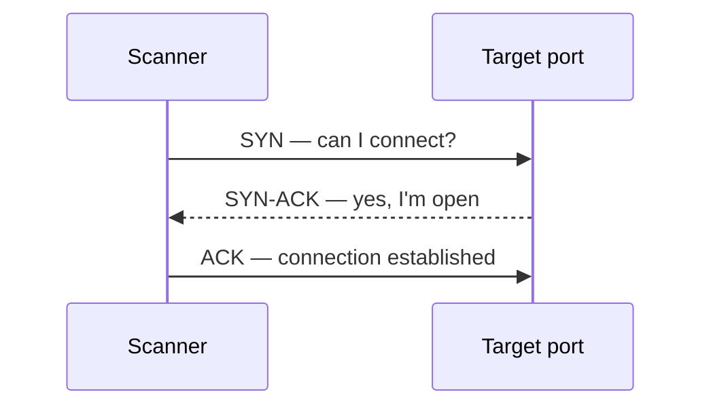

# Nmap

Nmap is a network-discovery, port-state inference, service-fingerprinting, and scriptable enumeration platform. Its output is *evidence about packets and responses* — not proof of vulnerability. It is the single most important tool in an assessor's kit, and learning it well means learning how the network answers a probe.

> [!warning] Scope first
> Scan only approved addresses and rates. Use reserved examples such as `192.0.2.0/24` in documentation; replace them only with an engagement allowlist.

## Parent Learning Order
Nmap -> Masscan -> RustScan

## Inferring state from a reply, or from silence

> *Does a port scanner ever actually see an open port?*
>
> Hold your answer — the section below is the response.

A scanner never "sees" an open port. It sends a probe and **infers** the port's state from the reply — or from silence. The whole tool rests on the TCP handshake and a small set of possible responses.



The possible replies, and what each scan type infers from them:

| Scan | reply = OPEN | reply = CLOSED | silence means |
|:--|:--|:--|:--|
| SYN `-sS` (half-open) | `SYN-ACK` | `RST` | filtered |
| Connect `-sT` (full) | handshake completes | `RST` | filtered |
| UDP `-sU` | a UDP reply | `ICMP port-unreachable` | `open`&#124;`filtered` |

`filtered` and `open|filtered` are the genuinely hard results, because silence is
ambiguous — a firewall dropping the probe is indistinguishable from a lost
packet. That is why UDP scanning is slow and uncertain, and why a surprising
state always needs a second technique to confirm. `-sS` sends `RST` instead of
the final `ACK`, so the connection never completes and the application never logs
a session; `-sT` needs no privileges but completes the handshake, and the
application sees it.

## The flags you actually use, grouped by phase

**Install and verify** — record the version, because bundled NSE scripts change behaviour:

```shell-session
operator@lab:~$ sudo apt install nmap
operator@lab:~$ nmap --version | head -n 2
Nmap version 7.95 ( https://nmap.org )
Platform: x86_64-pc-linux-gnu
```

Nmap has a large flag surface; these are the ones you actually use, grouped by phase.

**Target specification** — *who* to scan:

| Flag | Meaning |
|---|---|
| `192.0.2.10`, `192.0.2.0/24`, `192.0.2.1-50` | single host · CIDR · range |
| `-iL targets.txt` | read targets from a file |
| `--exclude host` / `--excludefile f` | carve exclusions out of the range |
| `-sL` | list-scan: expand the target list, send *no* packets |

**Host discovery** — decide which hosts are "up" *before* port-scanning:

| Flag | Meaning |
|---|---|
| `-sn` | ping sweep only — discover live hosts, **no** port scan |
| `-Pn` | **skip discovery, treat every host as up** — essential when hosts don't reply to ping (blocks the whole scan otherwise), but scans dead hosts too (slow) |
| `-PS22,80,443` / `-PA` / `-PU` | discovery via TCP SYN / TCP ACK / UDP probes to given ports |
| `-PE` / `-PP` / `-PM` | ICMP echo / timestamp / netmask discovery |
| `-n` | **never do DNS resolution** — faster, and avoids tipping off DNS logs |
| `-R` | force reverse-DNS even on down hosts |

> `-Pn` and `-n` are the two you'll reach for constantly. `-Pn` is "the host is firewalled against ping, scan it anyway" — it is **not** stealth. `-n` strips reverse-DNS latency and leakage.

**Port specification** — *which* ports:

| Flag | Meaning |
|---|---|
| `-p 22,80,443` | explicit list |
| `-p 1-1000` / `-p-` | a range / **all 65,535 ports** |
| `-F` | fast — top 100 ports only |
| `--top-ports 1000` | the N most common ports |
| `-p U:53,T:80` | mix UDP and TCP port sets |
| `-r` | scan ports sequentially (default is randomized) |
| `--exclude-ports` | skip specific ports |

**Scan techniques** — *how* to probe (map onto the diagram):

| Flag | Technique |
|---|---|
| `-sS` | TCP SYN "half-open" — fast, stealthier, needs root |
| `-sT` | TCP connect — no root, but the app logs the session |
| `-sU` | UDP — slow, ambiguous (`open\|filtered`) |
| `-sA` | ACK — maps firewall statefulness, not open ports |
| `-sN` / `-sF` / `-sX` | Null / FIN / Xmas — no-flag/odd-flag inference (evasion) |

**Service, OS & scripts** — turn a port into detail:

| Flag | Meaning |
|---|---|
| `-sV` | service/version detection · `--version-intensity 0-9` |
| `-O` | OS fingerprinting · `--osscan-guess` |
| `-A` | aggressive: `-sV -O` + default scripts + traceroute |
| `--script default,safe` / `--script vuln` | run NSE by category |
| `--script http-title --script-args k=v` | run a specific script with args |

**Timing & performance** — speed vs. stealth vs. accuracy:

| Flag | Meaning |
|---|---|
| `-T0`…`-T5` | templates: `T0` paranoid (IDS-evasion slow) → `T5` insane (fast, lossy); `T3` default, `T4` typical |
| `--min-rate` / `--max-rate N` | packets/sec floor/ceiling (prefer over `-T` for control) |
| `--scan-delay` / `--max-scan-delay` | pause between probes (dodge rate-limits) |
| `--host-timeout` | give up on a slow host |
| `--max-retries N` | retransmits before marking filtered |

**Firewall / IDS evasion** (RoE-approved only): `-f` / `--mtu` (fragment), `-D decoy1,decoy2,ME` (decoys), `-S src` (spoof source), `-g`/`--source-port 53` (source-port trust abuse), `--data-length`, `--spoof-mac`.

**Output & diagnostics** — always keep evidence:

| Flag | Meaning |
|---|---|
| `-oN`/`-oX`/`-oG file` | normal / **XML** / grepable |
| `-oA base` | write all three at once (do this every scan) |
| `-v`/`-vv`, `-d` | verbosity / debug |
| `--reason` | *why* Nmap decided each state (`syn-ack`, `no-response`) |
| `--open` | show only open ports |
| `--packet-trace` | dump every packet sent/received |
| `--resume out.gnmap` | resume an interrupted scan |

**Common invocations, decoded:**

```shell-session
# Host discovery only, no DNS, no port scan
operator@lab:~$ nmap -sn -n 192.0.2.0/24
# Full-port SYN scan of a firewalled host, with service detection + evidence
operator@lab:~$ sudo nmap -Pn -n -sS -sV -p- --min-rate 500 --reason 192.0.2.10 -oA evidence/full
# Fast top-100 look with default scripts
operator@lab:~$ nmap -F -sV --script default 192.0.2.10 -oA evidence/quick
```

Read that middle line as a sentence: *don't ping first* (`-Pn`), *don't resolve DNS* (`-n`), *half-open* (`-sS`), *fingerprint versions* (`-sV`), *every port* (`-p-`), *at ≥500 pkt/s* (`--min-rate`), *show me why* (`--reason`), *save everything* (`-oA`).

## Why -sS and -sT are a detection choice

The difference between `-sS` and `-sT` is not cosmetic — it is a packet-level and a *detection* choice. `-sS` sends a `RST` instead of the final `ACK`, so the connection never completes and the target application never logs a session (but it needs raw-socket privilege). `-sT` uses the OS `connect()` call, needs no privilege, but completes the handshake — the app sees and logs it. Choosing wrong changes both your footprint and what you can run.

```shell-session
operator@range:~$ sudo nmap -sS -Pn -p- --reason 192.0.2.10 -oA evidence/02-tcp
PORT    STATE    SERVICE REASON
22/tcp  open     ssh     syn-ack ttl 64
80/tcp  closed   http    reset ttl 64
443/tcp filtered https   no-response
operator@range:~$ sudo nmap -sU -p53,123,161 192.0.2.10
53/udp  open          domain
123/udp open|filtered ntp
161/udp closed        snmp
```

**The deliberate break:** `443/tcp` is `filtered` with reason `no-response`, and `123/udp` is `open|filtered` — both are the *ambiguous* states from the diagram. A novice reports "443 closed" and "123 open"; the truth is "a firewall is dropping probes to 443" and "123 might be open, I can't tell from silence." `--reason` exposes *why* Nmap decided each state, which is the difference between a guess and evidence. Validate surprising states with a packet capture or a second technique — load balancers, proxies, tarpits, and host firewalls all distort fingerprints.

**Defensive visibility:** discovery produces recognizable fan-out — many destination ports from one source, incomplete handshakes, unusual flag combinations, and NSE application requests. During purple-team work, correlate scanner source, firewall flow logs, and target service logs; success means the assessment evidence and the defensive evidence describe the same activity.

## Summary

You should now be able to:

- Interpret an `open|filtered` UDP result, and explain why it is ambiguous.
- Distinguish a host firewall from a routing or source-address problem when a scan shows everything `filtered`.
- Explain how `-sS` and `-sT` differ at the packet level, and why one needs root while the other is logged by the application.

---
> 🔼 Up: [[Network Discovery Tools]]
