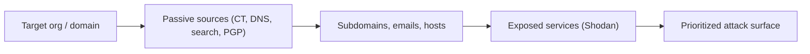

# OSINT & Reconnaissance Tools

> [!warning] Passive first, authorized always
> These tools query third-party data sources and public infrastructure. Passive OSINT touches only public records; active enumeration touches the target's DNS/hosts and belongs inside scope. Never brute a live target under the label "recon."

Reconnaissance builds the map before the assessment: which domains, subdomains, hosts, emails, and exposed services belong to the target. This category is the *passive* front of the kill chain — most of it happens without sending a single packet to the target, by mining DNS, certificate transparency, search engines, and internet-wide scan data.



## Tools in this category

- [[theHarvester]]
- [[Amass]]
- [[Shodan]]

```text
Enumerate names -> resolve to hosts -> identify exposed services -> hand a scoped target list to discovery
```

The methodology behind these tools lives in **Offensive Security → Reconnaissance & Attack Surface**; this branch documents the instruments.

---
> 🔼 Up: [[Offensive Tools]]
