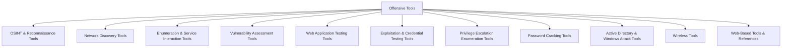

# Offensive Tools

> [!warning] Authorized operations only
> The Armory is organized by operational purpose. Every tool has one parent category and must be constrained by the engagement scope, rate limits, and evidence policy.



## Purpose categories

- [[OSINT & Reconnaissance Tools]]
- [[Network Discovery Tools]]
- [[Enumeration & Service Interaction Tools]]
- [[Vulnerability Assessment Tools]]
- [[Web Application Testing Tools]]
- [[Exploitation & Credential Testing Tools]]
- [[Privilege Escalation Enumeration Tools]]
- [[Password Cracking Tools]]
- [[Active Directory & Windows Attack Tools]]
- [[Wireless Tools]]
- [[Web-Based Tools & References]]

```text
Discover -> enumerate -> assess -> manually validate -> demonstrate bounded impact
```

---
> 🔼 Up: [[Tooling]]
