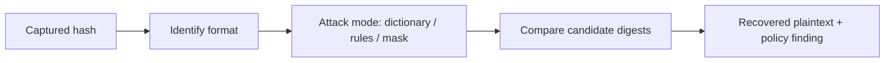

# Password Cracking Tools

> [!warning] Authorized recovery only
> Crack only hashes you captured under an authorized engagement or generated yourself in a lab. Cracking proves password *weakness*; it is not a licence to reuse recovered credentials outside scope.

Offline password cracking takes a captured **hash** and searches for an input that reproduces it. Unlike online brute-forcing (see **Hydra**), it never touches the target — speed is bounded only by your hardware and the hash's cost function. The two dominant engines differ in philosophy: John the Ripper is the versatile, format-detecting workhorse; Hashcat is the GPU-accelerated speed champion.



## Tools in this category

- [[name-that-hash]]
- [[hash-identifier]]
- [[John the Ripper]]
- [[Hashcat]]

```text
Capture hash -> identify format -> dictionary+rules -> mask/brute for the remainder -> report password-policy weakness
```

This category pairs with your own **Hashsmith** tool in *Writing Your Own Tools*, which explores building a hashing/cracking pipeline from first principles.

---
> 🔼 Up: [[Offensive Tools]]
