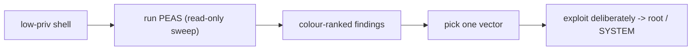

# Privilege Escalation Enumeration Tools

> [!warning] Authorized operations only
> These scripts run on a host after you already have a foothold. Use only on systems in scope. They enumerate; they do not exploit — you choose and demonstrate the escalation deliberately.

Once you land a low-privileged shell, the question is: *which single misconfiguration turns this into root/SYSTEM?* Checking every vector by hand is slow and error-prone. The **PEASS-ng** family (LinPEAS, WinPEAS) automates that sweep — reading dozens of local privilege-escalation vectors and **colour-ranking** them so the operator can focus on the one likely path instead of a checklist of hundreds.



## Tools in this category

- [[LinPEAS]]
- [[WinPEAS]]

```text
Foothold -> enumerate the surface -> triage by likelihood -> exploit one vector -> escalate
```

The escalation *techniques* these tools surface are taught in **Offensive Security → Privilege Escalation** and **OS Internals**; this branch documents the enumeration instruments.

---
> 🔼 Up: [[Offensive Tools]]
