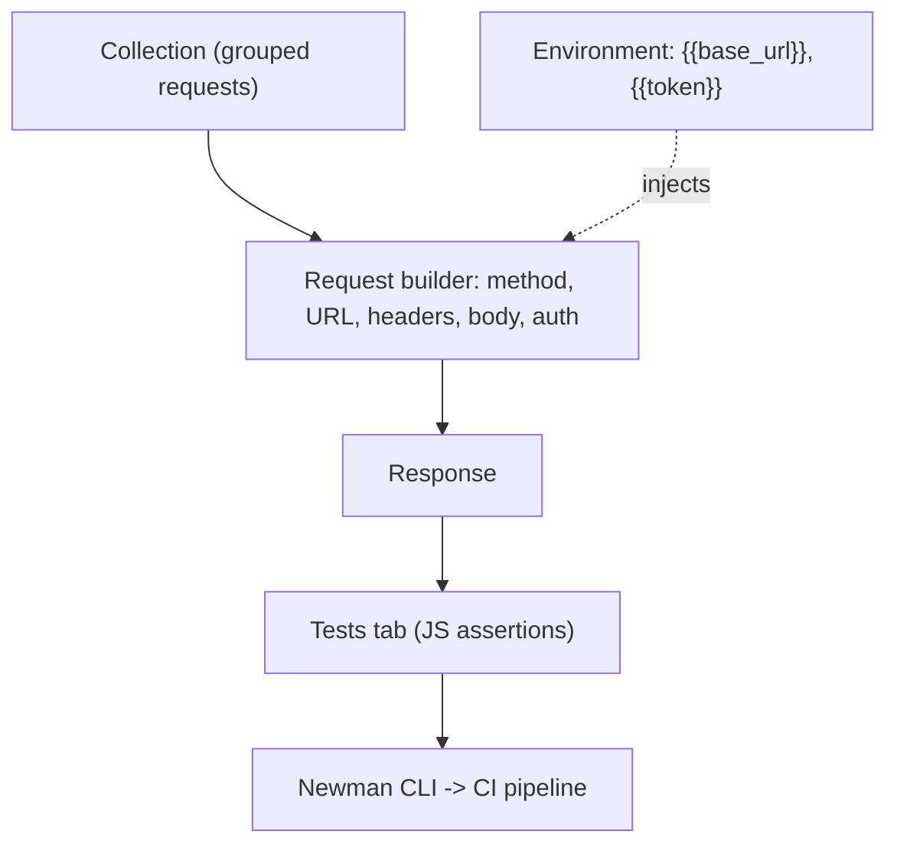

# Postman

Postman is the graphical API workbench. Where curl sends one request, Postman organizes **collections** of requests, manages **environments** and variables, handles complex auth (OAuth2, Bearer, HMAC), and runs **test scripts** against responses. For modern targets that are mostly JSON APIs, it is the fastest way to map an API, replay authenticated calls, and automate a regression suite — including a CLI runner (`newman`) for CI.

> [!warning] Authorized targets only
> Postman replays real, often authenticated, API calls. Use a dedicated test environment and credentials, and never point a collection at production without scope.

## Parent Learning Order
curl -> Postman -> Burp Suite -> OWASP ZAP -> Nikto -> WPScan -> SQLmap

## Structured input, structured output, gated by auth

An API is a set of endpoints that take structured input (usually JSON) and return structured output, gated by authentication. Testing one request by hand is easy; the hard part is testing *many* requests, as *different users*, *repeatedly*, without re-typing tokens. Postman's answer is three layers stacked on top of a single request.



`{{variables}}` are the key idea: define `{{base_url}}` and `{{token}}` once in an *environment*, reference them everywhere, and switch from staging to your low-priv test user by changing one dropdown.

## Importing a spec, or pasting a curl command

**Build a request** by importing an OpenAPI/Swagger spec (Postman generates the whole collection) or pasting a curl command — *Import → Raw text → paste `curl ...`* converts it into a Postman request instantly. That curl↔Postman bridge means everything you learned in **curl** transfers directly.

**Capture auth once, reuse everywhere.** Put a login request first, then in its *Tests* tab save the returned token to an environment variable so every later request is authenticated:

```javascript
// Tests tab of the /login request
const body = pm.response.json();
pm.environment.set("token", body.access_token);
pm.test("login ok", () => pm.response.to.have.status(200));
```

Subsequent requests set `Authorization: Bearer {{token}}` and just work — no copy-paste.

**Find access-control bugs by swapping environments.** Save `customer_a` and `customer_b` tokens in two environments, then fire the *same* `GET /api/orders/{{order_id}}` at customer B's object using customer A's token — a classic IDOR/BOLA test, run in two clicks.

## Newman, and turning a collection into a CI gate

Postman's real power at the Root level is **Newman**, the CLI runner that turns a saved collection into a repeatable, CI-gating test suite:

```shell-session
operator@ci:~$ newman run api-tests.postman_collection.json -e staging.postman_environment.json
→ Login
  POST https://staging.example.test/login [200 OK, 412B, 141ms]
  ✓  login ok
→ Cross-tenant read (should be 404)
  GET https://staging.example.test/api/orders/9001 [200 OK, 512B, 88ms]
  1✗  expected 404 but got 200
┌─────────────────────────┬──────────┬──────────┐
│                         │ executed │   failed │
├─────────────────────────┼──────────┼──────────┤
│              assertions │        6 │        1 │
└─────────────────────────┴──────────┴──────────┘
```

**The deliberate break:** the "Cross-tenant read" test *expected a 404* — proof that customer A cannot see customer B's order — but got **200**. Newman fails the run (non-zero exit), so the broken-access-control regression blocks the pipeline. This is the payoff of Postman over curl: the authorization test is codified as an assertion, run every build, not a one-off manual check that rots.

Internals worth knowing: Postman variables have a **scope chain** (global → collection → environment → local), and a subtle bug is a stale global shadowing an environment value — check the variable's resolved value in the console. Pre-request scripts run *before* the request (used for HMAC signing or timestamp nonces). And beware secret hygiene: tokens saved in environments are stored locally and can sync to the cloud — use "secret" variable type and never commit exported environments containing live credentials.

## Summary

You should now be able to:

- Explain what collections, environments and `{{variables}}` each solve that raw curl does not.
- You have two users' tokens. Describe the two-click IDOR test Postman makes trivial.
- Explain how a Newman assertion turns a manual authorization check into a CI gate, using the cross-tenant 404 example.

---
> 🔼 Up: [[Web Application Testing Tools]]
