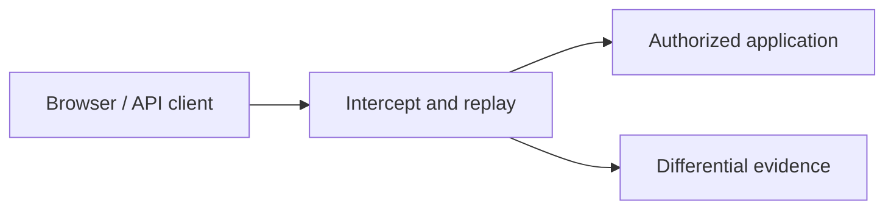

# Web Application Testing Tools

Tools for inspecting, replaying, transforming, and carefully automating HTTP behavior.



- [[curl]]
- [[Postman]]
- [[Burp Suite]]
- [[OWASP ZAP]]
- [[Nikto]]
- [[WPScan]]
- [[SQLmap]]

```shell-session
operator@lab:~$ printf '%s\n' 'Host: app.example.test' 'X-C2R-Test: authorized'
Host: app.example.test
X-C2R-Test: authorized
```

---
> 🔼 Up: [[Offensive Tools]]
