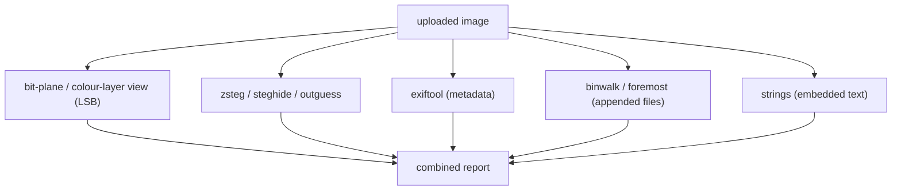

# Aperisolve

> [!abstract] Note of [[Web-Based Tools & References]]
> Aperisolve runs a whole battery of steganography tools on an uploaded image at once and shows the combined results — the fastest first pass for CTF forensics. This note covers why stego analysis runs every tool rather than one, why the container format decides which technique is even possible, and why a third-party upload service is only ever for non-sensitive files.

Aperisolve (`aperisolve.com`) is an online **steganography analysis** platform. Upload an image and it runs a whole battery of stego tools at once — layer/bit-plane visualisation, `zsteg`, `steghide`, `outguess`, `exiftool`, `binwalk`, `foremost`, and `strings` — then shows the combined results. It is the fastest first pass for CTF forensics/stego challenges, doing in one upload what would otherwise be a dozen manual commands.

> [!warning] Upload only non-sensitive images
> Aperisolve processes your file on a third-party server. Use it for CTF/lab images, never for images containing real sensitive data.

## Parent Learning Order
GTFOBins -> LOLBAS -> CrackStation -> Aperisolve -> revshells.com

## Data tucked into every layer of an image

> *An image is just numbers. How many places inside one can data hide?*
>
> Hold your answer — the section below is the response.

Steganography hides data *inside* a carrier file. An image is just numbers (pixel colour values + metadata + trailing bytes), and data can be tucked into any of those layers: the least-significant bits of pixels, an EXIF field, a password-protected `steghide` blob, or extra bytes appended after the image ends. No single tool checks all of them — so you run *all* of them.



Aperisolve is the "run every stego check in parallel and show me anything unusual" button.

## Chaining what each tool leaks into the next

Upload the image; Aperisolve returns each tool's output in tabs. A typical CTF find:

```text
[ Superimposed / bit planes ]  → hidden text visible in the red channel, plane 0 (LSB)
[ strings ]                    → "flag{...}" fragment near end of file
[ binwalk ]                    → Zip archive found at offset 0x4210 (appended after PNG)
[ exiftool ]                   → Comment: "pass: hunter2"  (→ feed to steghide)
[ steghide ]                   → needs passphrase (try the exiftool comment)
```

The layers chain: `exiftool` leaks a passphrase → you use it with `steghide`; `binwalk` finds an appended ZIP → you carve and extract it. Aperisolve surfaces the leads; you follow the chain.

## Why the format decides which technique is possible

The bit-plane view is the conceptual heart, and it reveals why **format matters**:

```text
PNG  (lossless)  → LSB steganography survives → bit-plane view shows hidden pixels
JPEG (lossy)     → recompression destroys LSBs → LSB stego does NOT survive
                    (JPEG stego uses DCT coefficients instead — different technique)
```

**The deliberate break:** LSB steganography — hiding data in the least-significant bit of each pixel — only works in **lossless** formats (PNG, BMP). Try it in a JPEG and the lossy DCT compression *rewrites* those low bits, destroying the payload. So when Aperisolve's bit-plane view shows clean noise on a JPEG, that's not "no stego" — it's "LSB can't live here; look for DCT-based hiding or appended data instead." Understanding *which* technique a given format permits stops you from concluding "nothing hidden" when you simply used the wrong lens. Aperisolve runs the tools; format literacy tells you which result is meaningful.

**How you'd spot it:** check the container format first, because it constrains which techniques are even possible. Clean bit-planes on a JPEG mean LSB could not have survived, not that nothing is hidden — look instead at data appended past the end-of-image marker, and at the DCT coefficients. On a PNG, clean bit-planes are genuine evidence of absence.

## Security Implications

**Uploading a file to a third party is the OpSec line, and stego files are exactly the wrong kind to cross it.** Aperisolve processes the image on a server you do not control, so an image that might contain real sensitive data — the very thing stego analysis is looking for — must never be uploaded. For anything outside a CTF or lab, run the underlying tools (`zsteg`, `steghide`, `binwalk`, `exiftool`) locally; the convenience of one upload is not worth handing a potentially secret-bearing file to an outside service.

**Format literacy prevents a false "nothing hidden".** LSB steganography survives only in lossless formats, so clean bit-planes on a JPEG mean LSB could not have lived there, not that the image is clean — the payload, if any, is in DCT coefficients or appended past the end-of-image marker. Concluding "no stego" from the wrong lens is the analytic error the tool cannot save you from.

**The findings chain, and each leaked artifact is a lead not a conclusion.** An `exiftool` comment feeds a `steghide` passphrase; a `binwalk` offset points at an appended archive to carve. Aperisolve surfaces the leads; following the chain and extracting locally is the work, and keeps the sensitive extraction off the public service.

Upload only non-sensitive CTF or lab images; real files with potential secrets stay on local tools.

## Summary

You should now be able to:

- Explain why stego analysis runs many tools instead of one.
- Interpret a ZIP at an offset in Aperisolve's `binwalk` tab, and act on it.
- Explain why LSB steganography survives in PNG but not JPEG, and what that tells you when the bit-plane view is clean.

---
> 🔼 Up: [[Web-Based Tools & References]]
