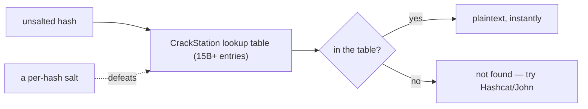

# CrackStation

CrackStation (`crackstation.net`) is a free online **hash lookup**. Paste an unsalted hash and it returns the plaintext instantly — not by cracking on demand, but by looking it up in a massive precomputed table of hash→password pairs built from wordlists and past breaches. For a weak, unsalted hash it is the fastest possible "crack": a single lookup.

> [!warning] Never paste real production hashes
> A public lookup service *sees everything you submit*. Use it for CTF/lab hashes only; real captured hashes stay in your offline tools (**Hashcat**/**John**).

## Parent Learning Order
GTFOBins -> LOLBAS -> CrackStation -> Aperisolve -> revshells.com

## Precomputing once, looking up forever

> *Cracking normally means guessing. What does a lookup table replace the guessing with?*
>
> Hold your answer — the section below is the response.

Cracking a hash normally means *guessing*: try a password, hash it, compare. A **lookup table** flips that around — precompute the hashes of billions of known passwords *once*, store them, and then any future hash is a database query. If a password has ever appeared in a wordlist or breach, its unsalted hash is already in the table.



## Identify, confirm unsalted, look it up

The workflow is trivial: identify the hash type (with **name-that-hash**), confirm it's *unsalted*, paste it, solve the CAPTCHA, read the plaintext.

```text
Input:   5f4dcc3b5aa765d61d8327deb882cf99   (MD5)
Result:  password        (found — MD5, in lookup table)

Input:   e90664c0af74160644d29e4d6147969b   (MD5)
Result:  Summer2024      (found)

Input:   $2b$12$R9h/cIPz0gi.URNNX3kh2O...   (bcrypt)
Result:  not found — salted/slow hash, lookup impossible
```

It supports MD5, SHA1, SHA256, and other **unsalted** fast hashes — the ones a lookup table can enumerate.

## The single fact that is both its power and its limit

CrackStation's power and its hard limit are the same fact: it only works on **unsalted** hashes.

```text
MD5("password")        = 5f4dcc3b...   → always the same → in the table → cracked
MD5("password"+"a1B9") = 7c2e51f3...   → unique per salt → NOT in any table → safe
```

**The deliberate break:** the *identical password* `password` is instantly recovered when hashed bare, but **unrecoverable** the moment a per-user salt is added — because the salt makes each hash unique, so no precomputed table can ever contain it. That is precisely why salting exists: it doesn't make one password stronger, it makes *precomputation useless*, forcing an attacker back to slow per-hash guessing (Hashcat/John). CrackStation is therefore the clearest possible demonstration of *why every stored password must be salted* — and why bcrypt/argon2 (salted **and** slow) defeat it twice over.

**How you'd spot it:** look at the structure of the stored value. A bare digest and nothing else is a lookup candidate; anything carrying a per-user component — a `$`-delimited field, a separate salt column, a `$2b$` prefix — cannot be in any precomputed table, and time on lookup sites is wasted. The check takes a second and saves the entire detour.

## Summary

You should now be able to:

- Explain how a lookup table "cracks" a hash instantly without guessing.
- Explain why CrackStation is the wrong tool for a bcrypt hash, and choose what to use instead.
- Explain, using the same password hashed with and without a salt, why salting defeats lookup tables.

---
> 🔼 Up: [[Web-Based Tools & References]]
