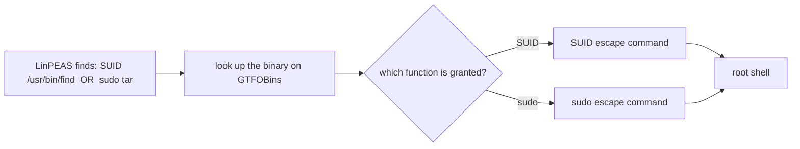

# GTFOBins

GTFOBins (`gtfobins.github.io`) is a curated reference of legitimate Unix binaries that can be **abused to break out of a restricted context** — escalate via SUID or sudo, escape a limited shell, read/write protected files, or transfer data. It doesn't run anything; it's the lookup that turns "I found a weird SUID binary" into "here's the exact command that gives me root."

> [!warning] Authorized privilege escalation only
> The escapes here yield real elevated access. Use only on hosts you are authorized to assess.

## Parent Learning Order
GTFOBins -> LOLBAS -> CrackStation -> Aperisolve -> revshells.com

## Programs that do more than their name suggests

Unix ships hundreds of small programs, and many can do more than their name suggests. `find` can execute commands. `vim` can spawn a shell. `tar` can run a program on checkpoint. If one of those is granted extra power — a **SUID bit** (runs as its owner, often root) or a **sudo rule** — that hidden capability becomes a privilege-escalation path.



GTFOBins is the second half of a **LinPEAS** finding: LinPEAS says *"this binary is exploitable"*; GTFOBins tells you *how*.

## Indexed by the capability you already have

The site indexes each binary by *function* — `shell`, `suid`, `sudo`, `file-read`, `file-write`, `command`, `capabilities`. You look up the binary and the capability you have. Example: LinPEAS reports `find` is SUID-root. GTFOBins' `find` → `suid` entry gives:

```shell-session
low@target:~$ ls -l /usr/bin/find
-rwsr-xr-x 1 root root ... /usr/bin/find
low@target:~$ /usr/bin/find . -exec /bin/sh -p \; -quit
# id
uid=1000(low) euid=0(root)
```

Or a passwordless `sudo tar` (from GTFOBins' `tar` → `sudo` entry):

```shell-session
low@target:~$ sudo tar -cf /dev/null /dev/null --checkpoint=1 --checkpoint-action=exec=/bin/sh
# id
uid=0(root)
```

Each entry is a copy-paste recipe, annotated with the exact privilege it requires.

## The -p flag, and why shells drop privilege without it

The **`-p` flag on the `find` escape is not optional** — and forgetting it is the classic mistake:

```shell-session
low@target:~$ /usr/bin/find . -exec /bin/sh \; -quit      # no -p
$ id
uid=1000(low) gid=1000(low)          ← still low-priv!
low@target:~$ /usr/bin/find . -exec /bin/sh -p \; -quit   # -p keeps euid
# id
uid=1000(low) euid=0(root)
```

**The deliberate break:** the SUID binary runs with `euid=0`, but modern shells **drop privileges on startup** unless told not to — `bash`/`sh` reset the effective UID to the real UID for safety. The `-p` flag tells the shell to *preserve* the elevated euid; without it, you spawn a shell as root's child that immediately demotes itself back to you. GTFOBins gives the correct command, but understanding *why* `-p` matters (SUID sets euid, the shell drops it) is the difference between "the recipe didn't work" and root. The deeper lesson: GTFOBins is a map of *why least privilege and removing SUID bits matter* — every entry is a binary a hardened host shouldn't leave exploitable.

## Summary

You should now be able to:

- Turn a LinPEAS finding into an actual escalation with GTFOBins.
- Look up and apply the escape for `sudo -l` showing NOPASSWD on `vim`.
- Explain why the `-p` flag is required on the SUID `find` escape, in terms of real vs. effective UID.

---
> 🔼 Up: [[Web-Based Tools & References]]
