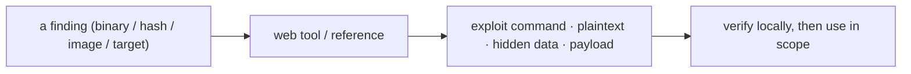

# Web-Based Tools & References

> [!warning] Authorized use; watch what you upload
> These run in a browser with nothing to install — but several send your input to a third party. Never paste production hashes, real credentials, or sensitive files into a public web service; use them for lab/CTF data or self-hosted instances.

Not every essential tool is a CLI you install. Some of the most-used resources in offensive work are **web apps and reference databases**: lookup sites that turn a binary name into an exploit, services that crack a weak hash in one click, and generators that write a payload for you. This category collects the browser-based tools worth a bookmark.



## Tools in this category

- [[GTFOBins]]
- [[LOLBAS]]
- [[CrackStation]]
- [[Aperisolve]]
- [[revshells.com]]

```text
Have an artifact -> look it up / process it in the browser -> get a lead -> verify and use under scope
```

## Summary

You should now be able to:

- Why is a reference site like GTFOBins a "tool" even though it runs nothing on the target?
- Which of these tools must you never feed real production data, and why?
- Explain the operational-security tradeoff of a public web tool (convenience) versus a self-hosted copy (no data leakage).

---
> 🔼 Up: [[Offensive Tools]]
