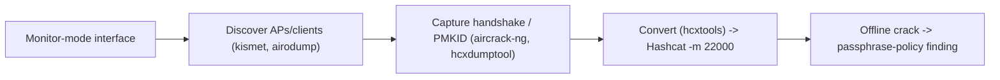

# Wireless Tools

> [!warning] Authorized RF testing only
> Radio is a shared medium — capturing and injecting frames affects every device in range, and spectrum use is regulated. Test only networks you own or are authorized to assess, and prefer an isolated lab AP.

Wireless assessment operates one layer below IP: on 802.11 frames, channels, and the RF medium itself. This category holds the instruments that discover networks and clients, capture the material needed to attack WPA2/WPA3, and convert it for offline cracking. The attack almost never breaks the crypto — it captures a handshake or PMKID and moves the fight **offline** (see **WPA2 Security Testing** and **Hashcat**).



## Tools in this category

- [[aircrack-ng]]
- [[Kismet]]
- [[hcxtools]]

```text
Monitor mode -> discover -> capture handshake/PMKID -> convert -> crack offline -> report weak PSK
```

---
> 🔼 Up: [[Offensive Tools]]
