# Command & Control Design Principles

Command-and-control (C2) is the infrastructure a red team uses to task and receive output from an implant on a target — the "how do I keep controlling this foothold?" layer of an operation. This note is about the *design principles*, framed strictly as **authorized adversary emulation**: understanding C2 architecture is what lets a red team emulate a real threat and a blue team detect one.

> [!danger] Authorized adversary emulation only
> Build and operate C2 only within a signed engagement, with a white team, deconfliction, and canary payloads. This note teaches architecture and detection, not evasion for its own sake.

## Parent Learning Order
Security Tool Architecture & Design Patterns -> Building Network Scanners -> Command & Control Design Principles -> Hashsmith Tool Architecture -> ShadowStep Tool Architecture

## A topology built so the operator is never exposed

> *Why is there anything at all between the operator's console and the target?*
>
> Hold your answer — the section below is the response.

A C2 is a distributed client/server system with a deliberate topology, built so that the operator is never directly exposed to the target.

```mermaid
flowchart LR
    OP["Operator console"] --> TS["Team server (C2)"]
    TS --> RD["Redirector (disposable)"]
    RD -->|beacon over HTTPS/DNS| B["Implant / beacon on target"]
    B -.->|tasks + output| RD
    RD -.-> TS
    classDef d fill:#3a1d24,stroke:#f85149
    class B d
```



The four roles: an **implant/beacon** on the target that calls home, a **listener** on the team server that receives it, a **redirector** in between (a disposable relay that hides the real server), and the **operator console**. The point of the redirector is separation — the target only ever talks to a throwaway host, so burning it doesn't burn the operation.

## Beacon behaviour as the dominant tunable

The tunable that dominates detectability is the **beacon's call-home behaviour**:

```text
sleep    = 60s      # how often the implant checks in
jitter   = 37%      # randomise each interval by ±37%  → 38–82s, not clockwork
profile  = "jquery" # malleable C2 profile: make the traffic look like a CDN/GET
channel  = HTTPS    # blend into normal web traffic (DNS as a fallback)
```

A **malleable profile** shapes the HTTP requests/responses to mimic legitimate traffic (a jQuery CDN fetch, an Office update). The comms channel (HTTPS, DNS, or domain-fronted) trades resilience against detectability. Everything is logged to the team server as engagement evidence, and stop conditions are wired in.

## The metronome that gives a beginner C2 away

The classic beginner C2 is trivially caught — by the exact technique the **Zeek** note teaches defenders:

```text
# naive beacon: fixed 60s sleep, no jitter
target → c2 : 10:00:00
target → c2 : 10:01:00
target → c2 : 10:02:00      ← a perfect metronome
# blue team, over conn.log:
cat conn.log | zeek-cut id.resp_h ts | (detect constant interval) → BEACON at 198.51.100.9
```

**The deliberate break:** a fixed-interval beacon produces a *metronomic* connection pattern that stands out in `conn.log` like a heartbeat — no payload signature needed, just the regularity gives it away (this is precisely the Zeek beacon-hunt from the defensive side). Adding **jitter** breaks the rhythm, a **malleable profile** makes each request look like ordinary web traffic, and a **redirector** means even a detected beacon leads to a throwaway host, not your infrastructure. This is the whole design tension: a C2 is a normal distributed system (the architecture note's separation-of-concerns applies — beacon, listener, redirector, console are clean components), but its *design goal* is to have its traffic and topology resist the detections in the Defensive branch. Building one for an authorized exercise is the best way to understand both sides: every C2 design choice (jitter, profile, redirector, channel) maps to a specific blue-team detection it's trying to survive — and documenting that mapping is what makes the exercise valuable to the defenders.

The arithmetic the defender runs is small enough to show in full. Take the check-in intervals from two beacons — one at a flat 60-second sleep, one at 60 seconds with 37% jitter — and compute the mean and standard deviation of the gaps:

```text
no jitter : [60, 60, 60, 60, 60, 60, 60, 60]     mean 60.0   stdev 0.0
37% jitter: [47, 71, 52, 80, 44, 66, 58, 74]     mean 61.5   stdev 12.4
```

The means are within a second of each other — jitter barely changes how often the implant calls home on average, which is what keeps it responsive. What it changes is the *spread*, and the spread is the entire signal. A standard deviation at or near zero is a machine; a human-driven session is bursty and irregular. This is why the detection is robust to encryption: it never looks at a single byte of payload, only at the timestamps, which TLS cannot hide.

**How you'd spot it:** from the defender's side it is exactly that arithmetic on `conn.log` — group by destination, take the intervals between connections, and look at their standard deviation. Near zero is a heartbeat, whatever the payload encryption. From the operator's side that same statistic is the self-check: if your jitter does not widen the distribution measurably, it is decorative.

## Summary

You should now be able to:

- Name the four C2 roles and explain why a redirector sits between the target and the team server.
- Explain what sleep, jitter and a malleable profile each control, and why jitter matters most for detection.
- Show how a no-jitter beacon is caught in `conn.log`, and map three C2 design choices to the blue-team detection each resists.

---
> 🔼 Up: [[Writing Your Own Tools]]
