# Command & Control Design Principles

Command-and-control (C2) is the infrastructure a red team uses to task and receive output from an implant on a target — the "how do I keep controlling this foothold?" layer of an operation. This note is about the *design principles*, framed strictly as **authorized adversary emulation**: understanding C2 architecture is what lets a red team emulate a real threat and a blue team detect one.

> [!danger] Authorized adversary emulation only
> Build and operate C2 only within a signed engagement, with a white team, deconfliction, and canary payloads. This note teaches architecture and detection, not evasion for its own sake.

## Parent Learning Order
Security Tool Architecture & Design Patterns -> Building Network Scanners -> Command & Control Design Principles -> Hashsmith Tool Architecture -> ShadowStep Tool Architecture

## Crook — The Mental Model

A C2 is a distributed client/server system with a deliberate topology, built so that the operator is never directly exposed to the target.

```mermaid
flowchart LR
    OP["Operator console"] --> TS["Team server (C2)"]
    TS --> RD["Redirector (disposable)"]
    RD -->|beacon over HTTPS/DNS| B["Implant / beacon on target"]
    B -.->|tasks + output| RD
    RD -.-> TS
    classDef d fill:#3a1d24,stroke:#f85149
    class B d
```



The four roles: an **implant/beacon** on the target that calls home, a **listener** on the team server that receives it, a **redirector** in between (a disposable relay that hides the real server), and the **operator console**. The point of the redirector is separation — the target only ever talks to a throwaway host, so burning it doesn't burn the operation.

## Operator — Make It Work

The tunable that dominates detectability is the **beacon's call-home behaviour**:

```text
sleep    = 60s      # how often the implant checks in
jitter   = 37%      # randomise each interval by ±37%  → 38–82s, not clockwork
profile  = "jquery" # malleable C2 profile: make the traffic look like a CDN/GET
channel  = HTTPS    # blend into normal web traffic (DNS as a fallback)
```

A **malleable profile** shapes the HTTP requests/responses to mimic legitimate traffic (a jQuery CDN fetch, an Office update). The comms channel (HTTPS, DNS, or domain-fronted) trades resilience against detectability. Everything is logged to the team server as engagement evidence, and stop conditions are wired in.

## Root — Internals & The Deliberate Break

The classic beginner C2 is trivially caught — by the exact technique the **Zeek** note teaches defenders:

```text
# naive beacon: fixed 60s sleep, no jitter
target → c2 : 10:00:00
target → c2 : 10:01:00
target → c2 : 10:02:00      ← a perfect metronome
# blue team, over conn.log:
cat conn.log | zeek-cut id.resp_h ts | (detect constant interval) → BEACON at 203.0.113.9
```

**The deliberate break:** a fixed-interval beacon produces a *metronomic* connection pattern that stands out in `conn.log` like a heartbeat — no payload signature needed, just the regularity gives it away (this is precisely the Zeek beacon-hunt from the defensive side). Adding **jitter** breaks the rhythm, a **malleable profile** makes each request look like ordinary web traffic, and a **redirector** means even a detected beacon leads to a throwaway host, not your infrastructure. This is the whole design tension: a C2 is a normal distributed system (the architecture note's separation-of-concerns applies — beacon, listener, redirector, console are clean components), but its *design goal* is to have its traffic and topology resist the detections in the Defensive branch. Building one for an authorized exercise is the best way to understand both sides: every C2 design choice (jitter, profile, redirector, channel) maps to a specific blue-team detection it's trying to survive — and documenting that mapping is what makes the exercise valuable to the defenders.

## Crook → Operator → Root Checkpoint

- **Crook:** Name the four C2 roles and explain why a redirector sits between the target and the team server.
- **Operator:** What do sleep, jitter, and a malleable profile each control, and why does jitter matter most for detection?
- **Root:** Show how a no-jitter beacon is caught in `conn.log`, and map three C2 design choices to the blue-team detection each resists.

---
> 🔼 Up: [[Writing Your Own Tools]]
