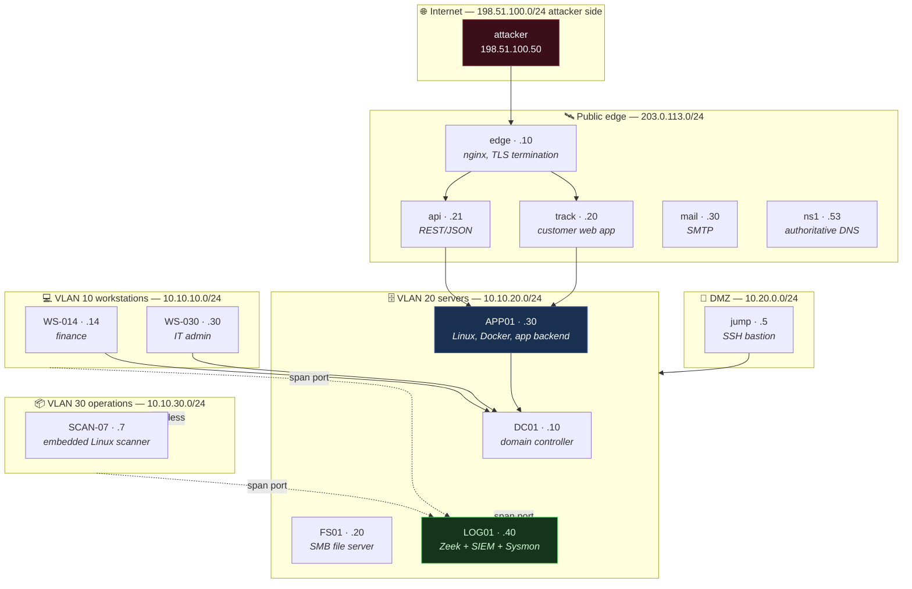

# The Thread — a proposed lab topology

**Status: proposal. Nothing in the corpus references this yet.**

The audit found 0% of notes refer to a shared running example, which means every
note re-orients the reader in a fresh imaginary environment. The Thread fixes that:
one topology, defined here, referenced by name everywhere else. Attention that
would go into "wait, what was `10.10.20.30` again" goes into the mechanism instead.

By note 200 the reader should know this network the way they would know a real one.

---

## 1. Naming rules (these are the load-bearing part)

Every value below comes from a range reserved for documentation. Nothing here can
ever collide with a real host, a real domain, or a real organisation.

| Kind | Reserved range | Authority |
|:--|:--|:--|
| Domain | `meridian.test` | RFC 6761 — `.test` is permanently reserved and can never be registered |
| Public IPv4 | `203.0.113.0/24` | RFC 5737 TEST-NET-3 |
| Second public range | `198.51.100.0/24` | RFC 5737 TEST-NET-2 (attacker infrastructure) |
| Private IPv4 | `10.10.0.0/16`, `10.20.0.0/24` | RFC 1918 |
| MAC addresses | `00:00:5E:00:53:00`–`FF` | RFC 7042 §2.1.2, reserved for documentation |
| Cloud metadata | `169.254.169.254` | link-local, the real metadata address |

**Meridian Freight** is a fictional mid-size logistics company. Non-tech on purpose:
its security failures read as ordinary rather than as negligence, and logistics
gives natural reasons for warehouse hardware, a customer-facing API, and a cloud
tracking bucket without inventing a pretext for each.

## 2. The topology

## 3. The hosts

| Host | Address | What it is | Domains it serves |
|:--|:--|:--|:--|
| `edge.meridian.test` | 203.0.113.10 | nginx reverse proxy, TLS termination, the lab CA's cert | Crypto (TLS/PKI), Networking (proxies) |
| `track.meridian.test` | 203.0.113.20 | Customer shipment-tracking web app. Deliberately weak. | AppSec (injection, IDOR, upload, SSRF, deserialization) |
| `api.meridian.test` | 203.0.113.21 | REST/JSON API, JWT-authenticated | API security, JWT, BOLA/BFLA |
| `mail.meridian.test` | 203.0.113.30 | SMTP, SPF/DKIM/DMARC records to inspect | Social engineering, email security |
| `ns1.meridian.test` | 203.0.113.53 | Authoritative DNS, one zone, DNSSEC optional | DNS recon, DNSSEC, subdomain enumeration |
| `jump.meridian.test` | 10.20.0.5 | SSH bastion, the only DMZ→LAN path | Pivoting, tunnelling, SSH |
| `DC01` | 10.10.20.10 | Windows Server domain controller, ADCS enabled | AD, Kerberos, NTLM, ADCS, BloodHound |
| `FS01` | 10.10.20.20 | Windows file server, SMB shares, one null session left on | SMB, enum4linux, Responder, relay |
| `APP01` | 10.10.20.30 | Ubuntu, Docker, the tracking backend, `/opt/meridian/routeplan` | Linux internals, privesc, containers, DevSecOps, exploit dev |
| `LOG01` | 10.10.20.40 | Zeek, Sysmon collection, SIEM | Defensive Security, detection engineering |
| `WS-014` | 10.10.10.14 | Windows 11, finance analyst | Phishing target, endpoint |
| `WS-030` | 10.10.10.30 | Windows 11, IT admin — *already referenced by the BloodHound note* | Lateral movement, sessions |
| `SCAN-07` | 10.10.30.7 | Embedded Linux barcode scanner, ancient firmware | Hardware/IoT, wireless |

**Wireless:** `MERIDIAN-CORP` (WPA2-Enterprise) and `MERIDIAN-GUEST` (WPA2-PSK,
weak passphrase). The existing hcxtools note's `CorpWiFi` / `GuestNet` map onto
these directly.

**Cloud:** bucket `meridian-tracking`, and `169.254.169.254` reachable from
`track` — the SSRF target that makes the cloud-metadata lesson concrete.

## 4. The identities

| Principal | Role | What it teaches |
|:--|:--|:--|
| `r.okonkwo` | Finance analyst, reused weak password | Phishing landing, password spray, initial access |
| `admin_bob` | IT admin, Domain Admins, *already in the BloodHound note* | The graph path, session hijack, lateral movement |
| `svc_backup` | Service account with an SPN, weak password | Kerberoasting |
| `svc_track` | App service account on APP01, over-permissioned | Linux privesc, secret hunting |

## 5. The shared artifacts

- **`meridian-2026-03-14.pcap`** — one reference capture. Every Networking note that
  reads a frame, a handshake, or a DNS query reads *this* capture. The reader
  learns one file deeply instead of twelve shallowly.
- **`/opt/meridian/routeplan`** — a small C service with a stack overflow and no
  PIE. The single binary for Exploit Development and Reverse Engineering.
- **The lab CA** — one root, one issued cert for `edge`. Every PKI, TLS and
  certificate example uses it, including the `openssl verify` failure/success pair
  that already exists in the TLS note.

## 6. Adoption rules

1. **Reference by name, never re-describe.** A note says "on `APP01`", links this
   document once, and moves on. Re-describing the topology in each note is the
   split-attention failure the standard exists to prevent.
2. **All-or-nothing per branch.** A branch adopts fully or not at all. A
   half-adopted running example is worse than none: readers learn to distrust
   references to a lab only half the notes use.
3. **Never a real value.** Any address, domain or MAC outside the reserved ranges
   in §1 is a defect, whether or not it resolves today.
4. **The topology is append-only.** Adding `SCAN-08` is fine. Renumbering `APP01`
   invalidates every note that cites it.

## 7. Honest cost, and what I would actually do

Retrofitting 302 notes is not worth it. Most already carry example values that are
correct and self-contained; churning them buys nothing and risks breaking working
prose.

**Recommended scope:**

- **All new notes** — mandatory from adoption.
- **The Tier 2 spine** (~40 notes) — retrofit as part of the rewrite that is
  happening to those notes anyway.
- **Everything else** — opportunistic. When a note is touched for another reason
  and its examples are already generic, move them onto The Thread.

Two notes already conform by accident (`WS-030` / `admin_bob` in BloodHound, the
lab CA in TLS & PKI), which is a reasonable sign the topology fits the corpus that
exists rather than the corpus I would have designed.

**One thing to decide before adoption:** the Ethernet note's cold open currently
uses `aa:bb:cc:11:22:33`. Under §1 that becomes a `00:00:5E:00:53:xx` documentation
MAC. That is a one-line change, but it is the kind of change that has to happen
everywhere at once or not at all.

---
> Related: **Teaching Standard** §2 (The Thread) · **Authoring Standard** (structure)
