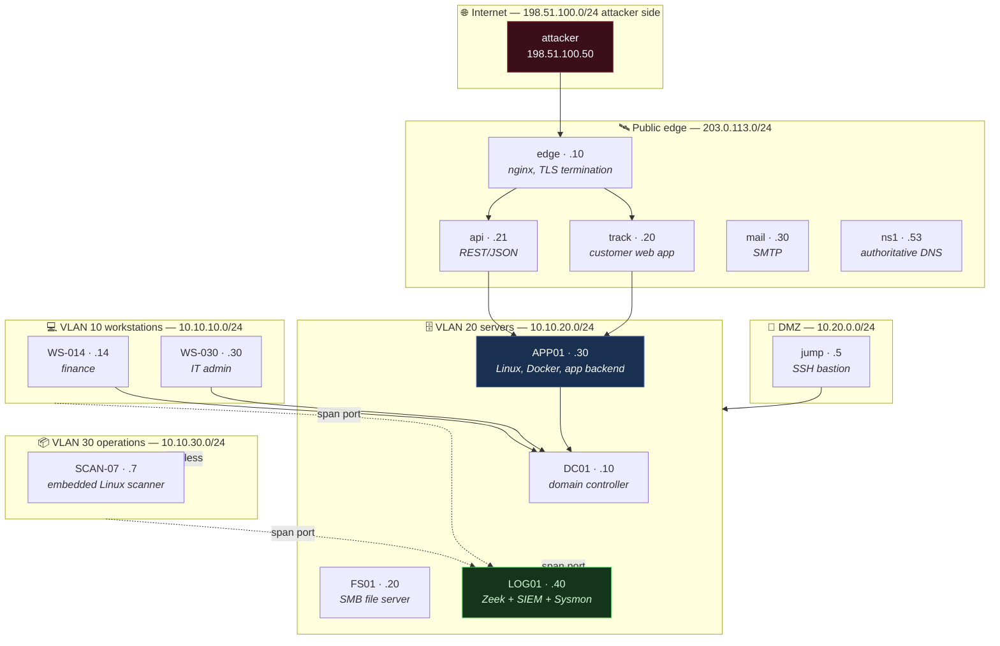

# The Thread — the Crook2Root lab topology

**Status: adopted, retrofit complete.** Every note that names a host, an address
or a MAC is on The Thread or carries a declared exemption. The gate enforces it.

The audit found 0% of notes refer to a shared running example, which means every
note re-orients the reader in a fresh imaginary environment. The Thread fixes that:
one topology, defined here, referenced by name everywhere else. Attention that
would go into "wait, what was `10.10.20.30` again" goes into the mechanism instead.

By note 200 the reader should know this network the way they would know a real one.

---

## 1. Naming rules (these are the load-bearing part)

Every value below comes from a range reserved for documentation. Nothing here can
ever collide with a real host, a real domain, or a real organisation.

| Kind | Reserved range | Authority |
|:--|:--|:--|
| Domain | `meridian.test` | RFC 6761 — `.test` is permanently reserved and can never be registered |
| Public IPv4 | `203.0.113.0/24` | RFC 5737 TEST-NET-3 |
| Second public range | `198.51.100.0/24` | RFC 5737 TEST-NET-2 (attacker infrastructure) |
| Third public range | `192.0.2.0/24` | RFC 5737 TEST-NET-1 (upstream providers and BGP peers — inter-AS links are public by nature) |
| Private IPv4 | `10.10.0.0/16`, `10.20.0.0/24` | RFC 1918 |
| MAC addresses | `00:00:5E:00:53:00`–`FF` | RFC 7042 §2.1.2, reserved for documentation |
| Cloud metadata | `169.254.169.254` | link-local, the real metadata address |
| MAC (locally administered) | any address with bit 1 of byte 0 set (`02:`, `6e:`, `8a:`) | RFC 7042 — used only where the LA bit is itself the lesson |
| IPv6 | `2001:db8::/32` | RFC 3849, reserved for documentation |

**Meridian Freight** is a fictional mid-size logistics company. Non-tech on purpose:
its security failures read as ordinary rather than as negligence, and logistics
gives natural reasons for warehouse hardware, a customer-facing API, and a cloud
tracking bucket without inventing a pretext for each.

## 2. The topology



## 3. The hosts

| Host | Address | What it is | Domains it serves |
|:--|:--|:--|:--|
| `edge.meridian.test` | 203.0.113.10 | nginx reverse proxy, TLS termination, the lab CA's cert | Crypto (TLS/PKI), Networking (proxies) |
| `track.meridian.test` | 203.0.113.20 | Customer shipment-tracking web app. Deliberately weak. | AppSec (injection, IDOR, upload, SSRF, deserialization) |
| `api.meridian.test` | 203.0.113.21 | REST/JSON API, JWT-authenticated | API security, JWT, BOLA/BFLA |
| `mail.meridian.test` | 203.0.113.30 | SMTP, SPF/DKIM/DMARC records to inspect | Social engineering, email security |
| `ns1.meridian.test` | 203.0.113.53 | Authoritative DNS, one zone, DNSSEC optional | DNS recon, DNSSEC, subdomain enumeration |
| `jump.meridian.test` | 10.20.0.5 | SSH bastion, the only DMZ→LAN path | Pivoting, tunnelling, SSH |
| `DC01` | 10.10.20.10 | Windows Server domain controller, ADCS enabled | AD, Kerberos, NTLM, ADCS, BloodHound |
| `FS01` | 10.10.20.20 | Windows file server, SMB shares, one null session left on | SMB, enum4linux, Responder, relay |
| `APP01` | 10.10.20.30 | Ubuntu, Docker, the tracking backend, `/opt/meridian/routeplan` | Linux internals, privesc, containers, DevSecOps, exploit dev |
| `LOG01` | 10.10.20.40 | Zeek, Sysmon collection, SIEM | Defensive Security, detection engineering |
| `WS-014` | 10.10.10.14 | Windows 11, finance analyst | Phishing target, endpoint |
| `WS-030` | 10.10.10.30 | Windows 11, IT admin — *already referenced by the BloodHound note* | Lateral movement, sessions |
| `SCAN-07` | 10.10.30.7 | Embedded Linux barcode scanner, ancient firmware | Hardware/IoT, wireless |

**Wireless:** `MERIDIAN-CORP` (WPA2-Enterprise) and `MERIDIAN-GUEST` (WPA2-PSK,
weak passphrase). The existing hcxtools note's `CorpWiFi` / `GuestNet` map onto
these directly.

**Cloud:** bucket `meridian-tracking`, and `169.254.169.254` reachable from
`track` — the SSRF target that makes the cloud-metadata lesson concrete.

## 4. The identities

| Principal | Role | What it teaches |
|:--|:--|:--|
| `r.okonkwo` | Finance analyst, reused weak password | Phishing landing, password spray, initial access |
| `admin_bob` | IT admin, Domain Admins, *already in the BloodHound note* | The graph path, session hijack, lateral movement |
| `svc_backup` | Service account with an SPN, weak password | Kerberoasting |
| `svc_track` | App service account on APP01, over-permissioned | Linux privesc, secret hunting |
| `k.adeyemi` | Help-desk technician, owns password resets and MFA recovery | Help-desk identity verification, recovery-path testing |
| `d.varga` | CFO, travels often, signs off payment exceptions | Vishing, executive impersonation, business email compromise |
| `p.nowak` | Facilities coordinator, owns badges and the visitor log | Tailgating, visitor process, physical social engineering |

The human-facing principals exist for the same reason the hosts do. A social
engineering note that invents "an employee at a company" each time asks the reader
to build a new workplace in their head before the lesson starts. Naming
`k.adeyemi` on the help desk and `d.varga` in the CFO's chair means the reader
already knows who picks up the phone, and the attention goes to the verification
step instead.

**Supplier of record:** `Halvard Pallet Systems`, in the Meridian vendor master
with bank details on file. Every supplier-fraud, bank-detail-change and
invoice-redirection example uses this one vendor.

**Exercise ticket prefix:** authorised social engineering exercises carry a canary
reference of the form `SE-TEST-nnn` (finance-side variants use `FIN-TEST-nnn`).
The canary is what makes an exercise auditable after the fact: it appears in the
ticket, in the operator's call card, and in the debrief, and it is the string a
defender can search to prove a given event was the test rather than a real attack.

## 5. The shared artifacts

- **`meridian-2026-03-14.pcap`** — one reference capture. Every Networking note that
  reads a frame, a handshake, or a DNS query reads *this* capture. The reader
  learns one file deeply instead of twelve shallowly.
- **`/opt/meridian/routeplan`** — a small C service with a stack overflow and no
  PIE. The single binary for Exploit Development and Reverse Engineering.
- **The lab CA** — one root, one issued cert for `edge`. Every PKI, TLS and
  certificate example uses it, including the `openssl verify` failure/success pair
  that already exists in the TLS note.

## 5a. MAC allocation

Every Meridian host has one MAC, from the RFC 7042 documentation block. The last
byte is the host's identifier; the first five bytes are constant, exactly as a
real single-vendor fleet would look.

| MAC | Host |
|:--|:--|
| `00:00:5E:00:53:01` | VLAN 10 gateway (10.10.10.1) |
| `00:00:5E:00:53:0E` | `WS-014` |
| `00:00:5E:00:53:1E` | `WS-030` |
| `00:00:5E:00:53:20` | `DC01` |
| `00:00:5E:00:53:21` | `FS01` |
| `00:00:5E:00:53:22` | `APP01` |
| `00:00:5E:00:53:23` | `LOG01` |
| `00:00:5E:00:53:30` | `SCAN-07` |
| `00:00:5E:00:53:40` | `jump` |
| `00:00:5E:00:53:50` | `edge` |
| `00:00:5E:00:53:C0` | the `MERIDIAN-CORP` access point |
| `00:00:5E:00:53:C1` | the `MERIDIAN-GUEST` access point |
| `00:00:5E:00:53:DE` | the attacker — deliberately memorable, used wherever a note shows a spoofed or hostile frame |

IPv6 hosts take `2001:db8:acad:<vlan>::<host>`, matching the IPv4 last octet:
`WS-030` is `2001:db8:acad:10::30`. Link-local gateways stay `fe80::1`.

## 5a-ii. Switches and port naming

Added when the switching branch needed somewhere concrete to put a trunk. Two
access switches are enough for every Layer 2 example in the corpus — one switch
demonstrates VLANs, two demonstrate trunking, spanning tree and hopping.

| Device | MAC | Role |
|:--|:--|:--|
| `SW-01` | `00:00:5E:00:53:F1` | Access switch. Carries VLANs 10, 20 and 30 |
| `SW-02` | `00:00:5E:00:53:F2` | Second access switch, same VLANs, joined to `SW-01` by a trunk |

Ports are named `Gi0/<n>`. Access ports live in `Gi0/1`–`Gi0/23`; the
inter-switch trunk is `Gi0/48` on both devices. Where a note shows an
**unhardened** switch the native VLAN is `1`, because that is the shipped
default and the default is usually the finding; where a note shows a
**hardened** one the native VLAN is `999`, an otherwise unused VLAN with no
access port assigned to it.

`SW-01` is the lower bridge ID of the two, so it is the spanning tree root
unless a note is specifically demonstrating a root takeover.

## 5b. What The Thread does NOT govern

This is the part that decides whether the retrofit improves the corpus or damages
it. Three categories of value are **exempt**, and rewriting them is a defect:

Declare an exemption in the note's frontmatter, with a reason — the gate reads it
and stops warning, and the reason stays reviewable:

```yaml
thread-exempt:
  - "10.99.0.: veth pair built on the reader's own machine — local reproduction"
```

A bare address with no reason is rejected as an error, so exemptions cannot become
a silent opt-out.

**1. Values whose identity is the lesson.** `127.0.0.1` teaches loopback semantics.
`0.0.0.0` teaches wildcard bind. `169.254.169.254` is the real cloud-metadata
address and the whole point of the SSRF example. Netmasks (`255.255.255.192`) are
arithmetic. A corpus scan found **145 of 766 IPv4 literals** in this category.

*Worked precedent:* `Ethernet & Frame Structure` demonstrates a veth pair whose
MACs are `8a:1f:2c:3d:4e:5f` and `6e:9a:0b:1c:2d:3e`, and the note teaches the
**locally-administered bit** from those exact hex digits. Moving them to
`00:00:5E:…` would make the paragraph false, because `00` has the LA bit clear.
Those addresses stayed. Only the note's cold open, where the addresses were
arbitrary scenery, moved onto The Thread.

**2. Local reproductions.** When a note has the reader build something on their own
machine — a veth pair, a Docker network, a loopback listener — that is not part of
Meridian's network and must not be dressed as one. The Thread describes a network
being *studied*, not every packet in every example.

**3. Address arithmetic.** Notes that teach subnetting, VLSM and summarisation
derive their examples from the relationships between specific prefixes.
`VLSM & Route Summarization` carries 34 distinct addresses; `Subnetting & CIDR`
carries 27. These may only move onto The Thread if the replacement preserves every
relationship being taught — which means re-deriving the worked examples, not
substituting strings. See §5c.

## 5c. The Meridian addressing plan (for the arithmetic notes)

So the subnetting notes can sit on The Thread without breaking their own maths,
Meridian is allocated a supernet with deliberate room:

```
10.10.0.0/16          Meridian corporate supernet
├── 10.10.10.0/24     VLAN 10  workstations      (254 hosts)
├── 10.10.20.0/24     VLAN 20  servers           (254 hosts)
├── 10.10.30.0/24     VLAN 30  operations        (254 hosts)
├── 10.10.40.0/22     the depot block — the VLSM worked example allocates it:
│   ├── 10.10.40.0/23     depot staff       (510 usable, need 500)
│   ├── 10.10.42.0/25     depot servers     (126 usable, need 100)
│   ├── 10.10.42.128/27   depot management  (30 usable, need 25)
│   ├── 10.10.42.160/30   depot router link (2 usable)
│   └── 10.10.42.164 — 10.10.43.255 free (348 addresses, still summarizable)
├── 10.10.192.0/20    the /20 worked example in Subnetting & CIDR
├── 10.10.60.0/24     VPN clients
├── 10.10.250.0/24    router interconnects / next-hops
└── 10.20.0.0/24      DMZ
```

`10.10.40.0/22` exists so VLSM, summarisation and subnetting examples have a
Thread-native range to work in. Every boundary above was verified with Python's
`ipaddress` module, not derived by hand: the four constituent `/24`s
(`10.10.40-43.0`) share 22 leading bits and 40 is a multiple of 4, so they
summarise to `10.10.40.0/22` — real arithmetic, on Meridian.

The migration also corrected a pre-existing error: the free-space figure in
VLSM & Route Summarization read "roughly 380 addresses"; `.164` to `.255` across
one octet boundary is **348**.

## 6. Adoption rules

0. **Exemptions first.** Before rewriting any value, check it against §5b. A
   protected value rewritten is a worse defect than a scenery value left alone.
1. **Reference by name, never re-describe.** A note says "on `APP01`", links this
   document once, and moves on. Re-describing the topology in each note is the
   split-attention failure the standard exists to prevent.
2. **All-or-nothing per branch.** A branch adopts fully or not at all. A
   half-adopted running example is worse than none: readers learn to distrust
   references to a lab only half the notes use.
3. **Never a real value.** Any address, domain or MAC outside the reserved ranges
   in §1 is a defect, whether or not it resolves today.
4. **The topology is append-only.** Adding `SCAN-08` is fine. Renumbering `APP01`
   invalidates every note that cites it.

## 7. Measured scope

From a scan of all 302 leaves:

| | Count |
|:--|--:|
| Notes containing no IPv4 literal at all | **179** |
| Notes containing at least one | 123 |
| Total IPv4 literals | 766 |
| **Notes off The Thread** (gate-measured) | **71** |
| **Addresses to migrate** (gate-measured) | **205** |
| Notes carrying >8 distinct addresses (arithmetic, §5c) | 5 |

The Thread is a **71-note change**, not a 302-note change. 179 notes — most of
Cryptography, most of OS Internals, the conceptual OffSec notes — name no host at
all. Of the 123 that do, 52 are already compliant: the corpus was already using
RFC 5737 documentation ranges in 58 places.

`pedagogy-check.py` is the authority on this number. Run it to see the live count.

Two notes already conform by accident (`WS-030` / `admin_bob` in BloodHound, the
lab CA in TLS & PKI), and the corpus already uses RFC 5737 ranges in 58 places,
which is a reasonable sign the topology fits the corpus that exists rather than
the corpus I would have designed.

## 8. Retrofit status — complete

All 302 leaves. `pedagogy-check.py` reports 0 off-Thread addresses and 0
off-Thread MACs.

| Branch | Status |
|:--|:--|
| Networking (60) | complete — batches 1–7 |
| OS Internals (40) | complete — batch 8 |
| Cryptography (15) | no host references |
| Application Security (4) | no host references |
| Defensive Security (2) | complete |
| Offensive Security (116) | complete — batches 11–14 |
| Tooling & Scripting (64) | complete — batches 15–16 |

### What the retrofit found

Six real routable addresses were in the corpus and are now gone: `93.184.216.34`
(the old example.com address, since changed), `142.250.180.4` (Google),
`185.22.11.4` and `81.143.211.90` (both used as C2 destinations in notes teaching
people to *spot* C2), and `93.0.2.10` (a typo of the documentation address
`192.0.2.10`). A note about detecting an attacker should not point at a
stranger's host.

Two arithmetic errors were corrected while verifying: the VLSM free-space figure
(348, not "roughly 380"), and a longest-prefix example whose destination stopped
matching its own route once the ladder moved.

### The exemption register

Twelve notes declare an exemption. Every one falls into a §5b class:

| Class | Notes |
|:--|:--|
| Identity is the lesson | the RFC 1918 / RFC 6598 range definitions; `10.0.0.0/8` where the 16-million figure depends on it; `01:80:c2:00:00:03`, the 802.1X PAE group address; the real vendor OUIs used for device fingerprinting and rogue-AP detection |
| Local reproduction | the veth pair and its LA-bit MACs; the ip-netns segments and their spoofed MACs |
| Not an address at all | two reversed `in-addr.arpa` names the gate reads as IPv4 |

---
> Related: **Teaching Standard** §2 (The Thread) · **Authoring Standard** (structure)
