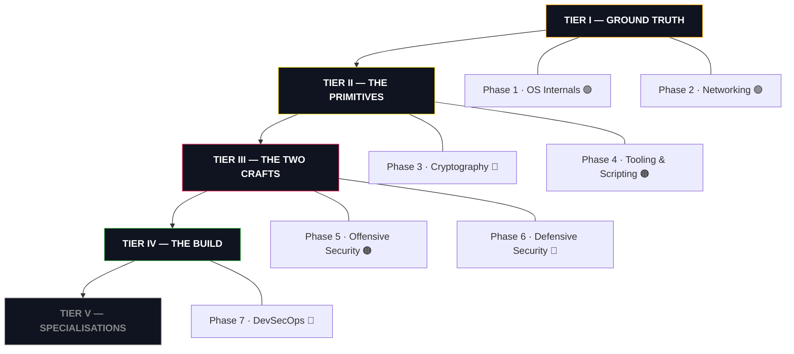
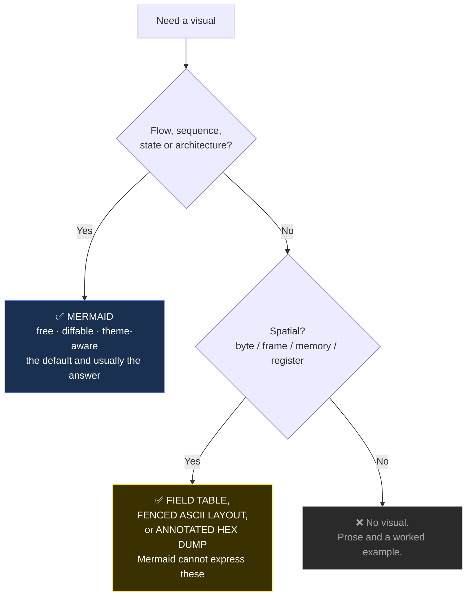
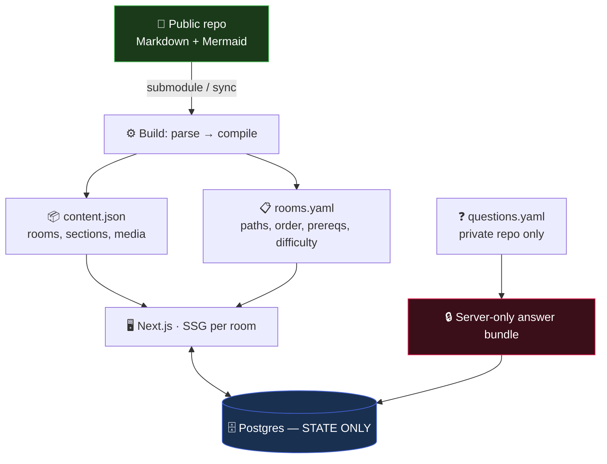

# Crook2Root Master Blueprint

> [!abstract] What this document is
> The **execution contract** for Crook2Root. It sits above `Crook2Root Authoring Standard.md` — the Standard defines *how a note is written*, this Blueprint defines *what gets written, in what order, with what media, and how the two repositories fit together*.
>
> Nothing here supersedes the Authoring Standard or `AGENTS.md`.

**Status:** Pillars 1–4 locked · Pillars 5–12 pending
**Revision:** v2 — post structure migration
**Baseline audit:** 2026-08-31
**Owner:** Salih (s4l1hs)

---

## 0. The Two-Repository Model

This is the decision everything else hangs from.

```mermaid
flowchart LR
    subgraph PUB["📖 PUBLIC — cybersec-crook2root-notes"]
        direction TB
        P1["391 Markdown notes<br/>302 technical leaves"]
        P2["Progressive sections per room"]
        P3["Worked examples<br/>real commands + real output"]
        P4["235 Mermaid diagrams & field maps"]
        P5["Per-note difficulty"]
    end
    subgraph PRIV["🔒 PRIVATE — website repo, later"]
        direction TB
        W1["Next.js platform"]
        W2["Practice questions per room"]
        W3["Hands-on labs & VMs"]
        W4["CTFs & flag submission"]
        W5["Accounts & progress"]
    end
    PUB -->|"content + diagrams<br/>consumed as source"| PRIV
    style PUB fill:#0f1420,stroke:#3CB44B,color:#fff
    style PRIV fill:#0f1420,stroke:#E6194B,color:#fff
```

| | **Public docs repo** (this one) | **Private website repo** |
|:--|:--|:--|
| Job | **Teaching** | **Assessment** |
| Contains | Explanation, worked examples, Mermaid diagrams | Labs, questions, quizzes, CTFs, flags, progress |
| Reader | Reads and learns | Does and is assessed |
| Source of truth for | All lesson content and every diagram | User state, questions, lab definitions |

**The rule that keeps both simple:** if it asks the reader to *do* something and then checks whether they did it, it belongs in the private repo. If it explains a mechanism, it belongs here.

This split has three concrete benefits. The public repo can be genuinely open without leaking answers. The website can be rebuilt, restyled or replatformed without touching a single lesson. And content authoring stays in Obsidian, in Markdown, in git — which is what makes mass content generation tractable at all.

---

## 1. Baseline — Where We Actually Are

Measured after the structure migration. Reproduce with `docs/scripts/content-audit.py`.

| Domain | Notes | Leaves | Median words | Thin (<800w) | Sections | Worked ex. | Summary | Difficulty | Visual |
|:--|--:|--:|--:|--:|--:|--:|--:|--:|--:|
| Offensive Security | 152 | 116 | 1,193 | 21 | 116 | 116 | 116 | 116 | 116 |
| Tooling & Scripting | 86 | 64 | **551** | 62 | 64 | 61 | 64 | 64 | 11 |
| Networking | 71 | 60 | 1,535 | 1 | 60 | 60 | 60 | 60 | 60 |
| OS Internals | 45 | 40 | 1,927 | 1 | 40 | 40 | 40 | 40 | 40 |
| Cryptography | 21 | 15 | 1,050 | 0 | 15 | 15 | 15 | 15 | 3 |
| Application Security | 7 | 4 | 1,024 | 0 | 4 | 4 | 4 | 4 | 2 |
| Defensive Security | 3 | 2 | 1,434 | 1 | 2 | 1 | 2 | 2 | 2 |
| DevSecOps | 2 | 1 | 2,554 | 0 | 1 | 1 | 1 | 1 | 1 |
| Cloud · RE/Malware · Hardware/IoT · AI | 4 | 0 | — | — | — | — | — | — | — |
| **Total** | **391** | **302** | — | **86** | **302** | **298** | **302** | **302** | **235** |

**Standard violations: 0.** No labs, checkpoints, level tags, three-level headings, reader tasking, question boxes, image files or `Task N` headings remain anywhere in the vault.

### What the migration cost, stated plainly

Removing 205 lab sections was the right structural call, but it was not free:

| | Before migration | After | Δ |
|:--|--:|--:|--:|
| Notes at full depth (1,500–5,000w) | 144 | **64** | −80 |
| Networking median words | 1,823 | 1,503 | −320 |
| OS Internals median words | 2,232 | 1,960 | −272 |
| Offensive Security median words | 1,473 | 1,077 | −396 |

The labs carried real commands and real output — the most valuable content in the vault. That material is **not lost**: all 205 lab sections and 281 checkpoints are preserved under `.archive/` (2.0 MB, invisible to Obsidian). It is the raw material for two things: the worked examples that go back into these notes, and the labs the private website repo will need.

**This makes "restore depth via worked examples" the single largest content workstream**, ahead of Cryptography. 68 leaves currently have no worked example at all.

### The four findings that drive everything

1. **Networking and OS Internals remain the strongest domains** — 100/100 leaves with sections, summaries and visuals, medians still near 1,500–2,000 words. They need worked examples restored, not rewriting.
2. **Cryptography is still a skeleton.** 20 leaves, median 287 words, zero summaries, 6 worked examples, 5 visuals. It never had checkpoints to convert, so it emerged from the migration with the least structure of any domain.
3. **Tooling & Scripting now has the structure it lacked.** All 64 leaves carry proper sections and summaries; 61 have worked examples. Median is still 562 words — these are reference cards that need depth, not surgery.
4. **Defensive Security is still cheap to build.** ~35 defensive leaves already exist across Networking, Tooling and the OS domains. The website repo's path layer will assemble them without moving a file.

---

## 2. Pillar One — Master Curriculum Architecture

### 2.1 Library and Curriculum stay separate

The 12-domain tree is canonical and physically unchanged. Learning paths are a **view over it**, defined in the private website repo, not in this one.

That is a change from v1 of this Blueprint, and it follows from the two-repo split: path membership, ordering and prerequisites are platform concerns. Keeping them out of the public notes means a note is never coupled to a curriculum decision, and a path can be reordered without a single documentation commit.

What the public repo *does* carry, because it is genuinely part of the teaching:

- `Domain:` — the one parent edge
- `## Parent Learning Order` — the sibling reading order within a branch
- `difficulty/*` — what the room assumes of the reader

The website repo maps `note path → room` and adds ordering, prerequisites, points and flags in its own manifest.

### 2.2 The difficulty ladder

Ranks are gone. Difficulty is a per-room property on a four-point scale the website renders as a badge.

| Tag | Meaning | Count |
|:--|:--|--:|
| `difficulty/info` | Index and hub notes. Navigation only, no lesson sections. | 1 |
| `difficulty/easy` | Assumes no prior knowledge. Branch entry points. | 16 |
| `difficulty/medium` | Assumes the branch's earlier rooms. The working majority. | 156 |
| `difficulty/hard` | Internals, edge cases, exploitation depth. | 86 |

49 leaves still carry no difficulty tag — mostly Cryptography, Application Security and the index notes that need `difficulty/info`. That is a mechanical pass.

**The `easy` tier is under-populated at 16.** A platform competing for beginners needs far more entry points than that; expect the number to roughly triple as branch-opening rooms get tagged properly.

### 2.3 The seven phases

🟢 structurally complete, needs depth · 🟠 structure good, content thin · 🔴 must be built

---

#### Phase 1 — OS Internals 🟢

*40 leaves · median 1,927w · 40/40 sections · 40/40 worked examples · 40/40 summaries · 40/40 visuals · 1 thin*

| Module | Rooms | Focus |
|:--|--:|:--|
| OS Theory & Architecture | 4 | Processes & threads, CPU scheduling, memory & paging, I/O & filesystem paradigms |
| Linux | 13 | Distributions → CLI → filesystem → I/O & piping → permissions & processes → networking → boot & systemd → kernel internals → memory & storage → observability → hardening → privilege escalation |
| Windows | 14 | Architecture & kernel → CMD → PowerShell → filesystem & registry → services & boot → access control → identity → AD → networking → memory & mitigations → drivers → Sysinternals → logging → diagnostics |
| macOS | 9 | Darwin/XNU → CLI → APFS → daemons → security mechanisms → keychain → networking → binaries → forensics |

The strongest domain in the vault and the only one where every leaf has a worked example. **Work: 6 difficulty tags, 1 thin note, depth restoration where labs were removed. Est. 1 week.**

---

#### Phase 2 — Networking 🟢

*60 leaves · median 1,535w · 60/60 sections · 54/60 worked examples · 60/60 summaries · 1 thin*

Ten branches of six leaves — the most regular structure in the vault.

Network Foundations · Addressing & Subnetting · Switching & the Link Layer · Routing & the Network Layer · Transport Layer & Sockets · Core Network Services · Web & Application Protocols · Wireless Networking · Network Security Architecture · Network Analysis & Troubleshooting

`Ethernet & Frame Structure` remains the reference note: it opens at the envelope metaphor, then a field table and an annotated hex dump, EtherType demultiplexing, the FCS, the 46-byte floor, security implications, and a summary. **Work: 15 difficulty tags, 6 missing worked examples, depth restoration. Est. 1–2 weeks.**

---

#### Phase 3 — Cryptography 🔴 **CRITICAL**

*15 leaves · median 1,050w · 15/15 sections · 15/15 worked examples · 15/15 summaries · 3 visuals*

Still the priority-one build, and now the least structured domain. Impose the missing branch layer first — the existing 20 leaves map onto five branches of four with no orphans:

| Branch | Leaves absorbed |
|:--|:--|
| Encoding & Representation | Hexadecimal and Binary · Base64 and the Base Family · Encoding & Obfuscation · XOR and Classical Ciphers |
| Hashing & Integrity | Hash Functions and Integrity · Salting and KDFs · Hashing & Passwords · Password Cracking |
| Symmetric Cryptography | Symmetric Encryption · AES and Block Ciphers · Block Cipher Modes · Stream Ciphers |
| Asymmetric Cryptography | Asymmetric Encryption · RSA · Diffie Hellman and ECC · Digital Signatures |
| Applied Trust & Protocols | TLS and PKI · JWT Security · Applied Trust & Tooling · Hashsmith CLI |

Cryptography suits worked examples unusually well — everything runs locally with `openssl`, `python3` and `hashcat`, so the output is easy to capture and reproduce. Strong candidates:

- **Block Cipher Modes** — the same bitmap encrypted under ECB and CBC, side by side. The penguin is the best single visual in cryptography.
- **RSA** — two 512-bit moduli sharing a prime, factored with one `gcd()`; then the same attack failing against OAEP.
- **Salting and KDFs** — 1,000 unsalted SHA-256 hashes cracked in seconds, then the same passwords under bcrypt with the wall-clock difference shown.
- **TLS and PKI** — a private CA issuing a cert, `curl` rejecting it, the root installed, `curl` accepting it, then a backdated cert failing differently.

**Required authored SVGs** (spatial, Mermaid insufficient): AES state matrix and round structure · block-mode chaining · X.509 field layout · JWT three-segment structure · Merkle–Damgård vs sponge.

**Work: 5 branches, 20 rewrites at ~2,000w, ~8 SVGs, 20 summaries, 20 worked examples. Est. 3–4 weeks.**

---

#### Phase 4 — Tooling & Scripting 🟠

*64 leaves · median 551w · 64/64 sections · 61/64 worked examples · 64/64 summaries · 64/64 visuals*

The migration fixed this domain's structural problem. Every leaf now has proper sections and a summary, and 61 have a worked example. What remains is **depth**: a 551-word median against a 1,500-word floor.

These are good notes that stop early. `Nmap` opens by explaining that a scanner never *sees* an open port — it infers state from the reply, or from silence — and carries an authored port-state SVG. It just needs the internals and edge-case material a `hard` room should have.

| Module | Rooms |
|:--|--:|
| Programming for Security | 4 (Bash, Python, Go, C++) |
| Offensive Tools | ~40 across 10 categories |
| Defensive Tools | 14 across 5 categories |
| Writing Your Own Tools | 5 |

**Work: depth pass on 62 thin leaves, 4 difficulty tags, 3 worked examples. Est. 4–5 weeks, highly parallelisable.**

---

#### Phase 5 — Offensive Security 🟠

*116 leaves · median 1,193w · 116/116 sections · 116/116 worked examples · 116/116 summaries · 21 thin*

The largest domain, and the one hit hardest by lab removal — its median dropped 396 words. **44 leaves now have no worked example**, the biggest single gap in the vault.

| Module | Sub-branches | Rooms |
|:--|:--|--:|
| Penetration Testing | Methodologies · Recon · Vuln Assessment · Network · Web App · API · AD & Identity · Post-Exploitation · Wireless & Physical · Reporting & Purple Teaming · Guided Assessments | ~60 |
| Red Team Operations | C2 & OPSEC · Evasion · Lateral Operations · Cloud Red Team | ~20 |
| Social Engineering | Human Factors · Phishing · Voice & Help Desk · Physical · Governance | ~15 |
| Exploit Development | Foundations · Memory Corruption · Control Flow · Platform | ~20 |

`Guided Assessments` remains the natural capstone — full engagements documented end to end, **including the report**. Both incumbents are criticised for insufficient real-world preparation beyond technical exploitation. Nobody teaches the report.

**Work: 44 worked examples from the archive, 24 thin leaves, 16 difficulty tags. Est. 3–4 weeks.**

---

#### Phase 6 — Defensive Security 🔴

*2 leaves in-folder — ~35 defensive leaves already exist elsewhere*

| New module | Assembled from existing | New rooms |
|:--|:--|--:|
| Hardening & Controls | Linux/Windows/macOS hardening notes, Segmentation & Zero Trust, Firewall Architecture, NAC | ~2 |
| Telemetry & Logging | Windows Logging, Linux Observability, macOS Forensics, Sysmon, osquery | ~3 |
| Network Detection | Zeek, Suricata, Snort, Wireshark, tcpdump, Traffic Analysis, IDS/Monitoring | ~2 |
| Detection Engineering | Sigma, Splunk Basics, YARA | ~5 |
| Incident Response & Forensics | Volatility, CyberChef | ~6 |
| Threat Intelligence | — | ~4 |

**Work: ~22 new leaves. The path assembly happens in the website repo. Est. 3–4 weeks.**

---

#### Phase 7 — DevSecOps 🔴

*1 leaf: `Docker and Containers` (2,489w — a good seed)*

Containers & Runtime Security (5) · Orchestration Security (5) · Secure Delivery Pipelines (5) · Secrets & Supply Chain (5) · Infrastructure as Code (4)

**Work: ~24 new leaves + 5 branch indexes. Est. 4–5 weeks.**

---

### 2.4 Tier V — the remaining five domains

Priority order, each gated on the tiers below:

1. **Application Security** (4 leaves) — highest priority; largest hiring market, already part-scaffolded.
2. **Cloud Security** — gated on Phase 7; pairs with the existing Cloud Red Team branch.
3. **Reverse Engineering & Malware** — gated on Phase 1 memory work; pairs with Exploit Development.
4. **AI Security** — highest marketing value, lowest stable-content ratio, so last of the four to avoid immediate rot.
5. **Hardware & IoT** — highest equipment cost for learners; deliberately last.

---

## 3. Pillar Two — The Room Blueprint

### 3.1 Shape

Every technical leaf is a room made of plain, descriptive sections read in order.

| Section | Function | Required |
|:--|:--|:--|
| Frontmatter | One `Domain:`, `tree/*`, `type/*`, one `difficulty/*`, `Color:` | ✅ |
| `# Title` + `> [!abstract]` | Outcome in one or two sentences | ✅ |
| `## Parent Learning Order` | Plain text, first-degree siblings only | ✅ |
| `## <opening idea>` | Opens at zero: mental model, vocabulary, analogy + where it breaks | ✅ |
| `## <topic>` × N | Architecture, worked examples, internals, security implications | ✅ |
| `## Summary` | "You should now be able to:" + capabilities | ✅ |
| `> 🔼 Up: [[Parent]]` | Single parent link | ✅ |

Rules: **no numbering and no `Task N` prefix** — that is a website-repo construct · every section carries a descriptive title · order is carried by the heading sequence · cross-reference a section by naming it in **bold**, never by a number · index notes carry navigation, not lessons · one idea per section, split past ~700 words.

Full template: `docs/templates/Room Template.md`.

### 3.2 Worked examples — the distinction that matters

> **A lab says:** "Build this environment, run these commands, verify your result, then clean up."
> **A worked example says:** "Here is the command, here is exactly what it prints, and here is what each field means."

The reader follows along by reading. They may run the commands, but the note never depends on it, never asks them to, and never assumes they did.

Every worked example shows the exact command, its realistic output in its own fenced block, and a sentence naming which fields decide the conclusion. Somewhere in every note, at least one failure or misleading result appears with its mechanism explained — not "the value was wrong", but which parser rejected it, at which stage, and what it was checking.

Never: instructions to build infrastructure · questions or answer boxes · cleanup steps · "try this yourself".

### 3.3 Mining the archive

`.archive/labs/` holds 205 extracted lab sections; `.archive/checkpoints/` holds 281. These are the fastest route to restoring depth:

1. Open the archived lab for the note being repaired.
2. Keep the commands and their output verbatim — that material is already correct and already written.
3. Delete the setup steps, the "run this" framing, the cleanup, and any question.
4. Add the interpretation sentence under each output block.
5. Fold the result into the appropriate `##` section.

Roughly two thirds of a worked example is already written in the archive. **The same archive is the seed for the private repo's real labs** — the setup and cleanup steps deleted here are exactly what that repo needs.

---

## 4. Pillar Three — The Visual Standard

**Superseded, and revised 2026-09-02.** This pillar originally specified a
five-tier media pipeline ending in AI-generated imagery, with authored SVGs for
spatial subjects and terminal GIFs for command sequences. That model was
abandoned: all 227 image files were removed and instructional visuals became
**Mermaid-only**.

> [!warning] The reason recorded here was wrong
> This section previously stated that the removed visuals "read as
> AI-generated." Reading the actual files in `_to_delete/assets/` shows
> otherwise: they were **lifted third-party screenshots** — one still carrying a
> `DRAFT` watermark and a stack trace from an unrelated commercial course — and
> **generic stock clipart**. Unlicensed content and decoration, not AI art. The
> removal was correct; the stated justification was not, and the distinction
> changes what is permitted now. See **[[Crook2Root Visual Identity]]**.

A **brand-only** exception was adopted on 2026-09-02: platform identity assets
live in `docs/brand/`, in a technical-schematic style, and never appear inside a
note. `ci-check.py` enforces the boundary.

The decision procedure now has three outcomes, not five:

**Current state:** 235 Mermaid diagrams and field maps, and **0 image files in
any note**. The CI gate errors on an image file anywhere outside `docs/brand/`,
and on an `![[...]]` embed anywhere at all, so this is enforced rather than
agreed.

### What survived from the original pillar

The two rules that motivated the tiering turned out to be right, and outlast it:

1. **A visual that could mislead is worse than no visual.** Packet structures,
   memory layouts and protocol exchanges must be *exact*, which is why they are
   field tables and hex dumps rather than pictures — the same reason the original
   pillar forbade AI depiction of anything a reader could be misled by.
2. **Media that regenerates itself does not rot.** Mermaid is text: it diffs, it
   reviews, it survives a rename, and it never needs re-recording. Both incumbents
   are criticised for stale content, and a visual standard made of committed text
   is a structural answer rather than a promise.

The `verified:` date on notes containing shell commands (Teaching Standard §7) is
the other half of the same idea, applied to output rather than diagrams.

---

## 5. Pillar Four — Platform Evolution Roadmap

### 5.1 Phase A — Public repo to publication-ready

**Goal: a reader can learn Networking, OS Internals and Cryptography end to end, entirely by reading, and it is genuinely excellent.**

| # | Workstream | Scope | Est. |
|:--|:--|:--|:--|
| A1 | Difficulty completion | 49 missing tags + `difficulty/info` on all index notes | 2 days |
| A2 | Summary completion | 27 leaves, mostly Cryptography and AppSec | 3 days |
| A3 | **Worked-example restoration** | 68 leaves, mined from `.archive/labs/` — **largest workstream** | 4–5 weeks |
| A4 | **Cryptography rebuild** | 5 branches, 20 rewrites, ~8 SVGs — **critical path** | 3–4 weeks |
| A5 | Tooling depth pass | 62 thin leaves toward the 1,500-word floor | 4–5 weeks |
| A7 | CI validators | `content-audit.py` wired to fail on any standard violation | 2 days |

**Do A1, A2 and A7 first.** They are days of work, they make the vault self-policing, and a validator that does not exist cannot catch a mistake you are about to make 60 times.

**Exit criteria:** 0 standard violations · every leaf has sections, a summary, a difficulty tag and a worked example · Networking, OS Internals and Cryptography all at or above the 1,500-word floor.

### 5.2 Phase B — Private website repo

**Architecture: the public repo is a git submodule or scheduled content sync. Markdown stays canonical. The database stores state only, and never lesson prose.**

The private repo owns three things the public repo deliberately does not:

- **`rooms.yaml`** — maps each note path to a room id, and adds path membership, ordering, prerequisites and points. Path decisions change here without a documentation commit.
- **`questions.yaml`** — practice questions per room, keyed to section-heading anchors in the public note. This repo is also where a room's **task numbering** lives: the site builder numbers the public note's sections into Task 1…N at import time, so the numbering is a presentation decision the website owns and the documentation never carries.
- **`labs/`** — lab definitions, seeded from `.archive/labs/`, restoring the setup and cleanup steps the public repo dropped.

**Data model — state only.** `users` · `room_progress(user_id, room_id, status, content_version)` · `question_attempts` · `hint_reveals` · `points_ledger` · `lab_sessions` · `flags`. Every row references a stable `room_id` string. There is no content table, so content changes never require a migration.

Record `content_version` on `room_progress` from day one. When a public-repo note changes after a user completed it, that column is what tells you whether to re-prompt. Retrofitting it after thousands of users have progress is genuinely painful.

### 5.3 Phase C — Live labs

Firecracker microVMs inside Docker containers: the container handles networking and cleanup, the microVM gives a real kernel with hardware-backed isolation that containers alone cannot safely provide to a platform teaching privilege escalation. Xterm.js in the browser → WebSocket → SSH over a Unix socket; no public SSH port. Multi-host labs are microVM containers sharing a network namespace. A warm pool makes "Start Lab" feel instant.

**Economics**, from the closest public single-operator implementation of this exact architecture: **~$100/month total infrastructure at 100–200 concurrent playgrounds**, 80–90% of it worker servers, on Hetzner Auction bare metal at ~$40/month per 128 GB / 6-core box fitting tens of concurrent playgrounds. Live labs are not the six-figure problem they appear to be at this scale.

**Safety:** non-privileged users inside the VM · CPU/memory/rate limits · hard idle timeout · **egress restricted to DNS and HTTPS against an allowlist**. Non-negotiable for a platform teaching offensive security.

**Dynamic flags.** Both incumbents use static flags, so answers leak to public writeups within days. Ours are per user: `C2R{base32(HMAC-SHA256(secret, user_id ‖ room_id ‖ index))[:20]}`, injected at provision time. A shared flag is worthless to anyone else, and a submitted flag proves *that user* solved *that room*.

### 5.4 What we deliberately do not build

No mobile app · no video-first courses (the medium is text plus terminal, and text is diffable and regenerable) · no certification body (dynamic flags make credentials possible later; issuing them now would mean nothing) · no community forum before ~1,000 active learners · no payments before a path is genuinely finishable.

---

## 6. Risk Register

| Risk | Likelihood | Impact | Mitigation |
|:--|:--|:--|:--|
| Worked-example restoration stalls and the vault stays shallow | High | Critical | The material exists in `.archive/`. Two thirds of each example is already written. Treat it as editing, not authoring, and batch it per branch. |
| Cryptography rebuild stalls and blocks the foundations | High | Critical | 20 rooms, zero infrastructure cost. Timebox to 4 weeks. |
| Scope creep into the 5 empty domains | Very high | Critical | **No new domain starts until Networking, OS Internals and Cryptography are publication-ready.** |
| `.archive/` gets committed to the public repo and confuses readers | Medium | Low | It is dot-prefixed so Obsidian ignores it. Move it to the private repo when that repo exists. |
| The two repos drift — website expects a heading the note renamed | Medium | High | The website addresses content by `room_id` and section-heading anchors, never by filename or position. Validate the mapping in the website's CI, and treat a renamed heading as a breaking change on the site side. |
| Solo-builder burnout | High | Critical | Networking and OS Internals are structurally complete. Restore their worked examples first, publish, and let real readers set the order of everything after. |

---

## 7. The First 90 Days

| Weeks | Focus | Deliverable |
|:--|:--|:--|
| 1 | A1 + A2 + A7 | Every leaf tagged and summarised; CI fails on any violation |
| 2–6 | **A3 worked-example restoration** | 68 leaves repaired from the archive, Networking and OS Internals first |
| 3–6 | **A4 Cryptography rebuild** (parallel) | 5 branches, 20 rooms at full depth, ~8 SVGs |
| 8–12 | A5 Tooling depth pass | 62 leaves toward the 1,500-word floor |
| 10–13 | Private repo scaffold | `rooms.yaml`, content sync, Next.js shell rendering public notes |

**The measure of success at day 90:** a stranger with no security background can read Networking, OS Internals and Cryptography start to finish and come away able to read a packet capture, reason about a process's memory, and explain why a badly-parameterised RSA key falls — having never been asked to set anything up, and never left guessing what a command's output meant.

---

## 8. Open Decisions for Pillars 5–12

Brand and visual identity beyond the domain palette · pricing and the free/paid boundary · whether Application Security becomes Phase 8 or folds into Phases 5/6 · the community model · a certification track · localisation · whether Higgsfield remains the Tier 4 vendor once volume is known · and when `.archive/` migrates out of the public repo.

---

> **Twelve trees. One root. Crook → Root.**
