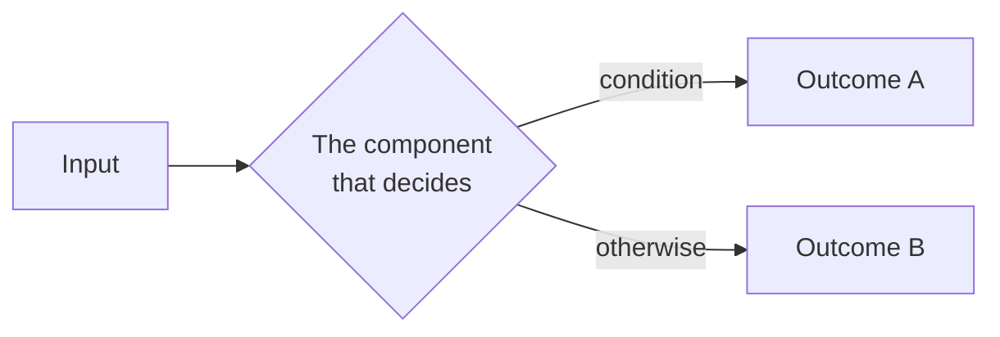

# 🔧 Topic Title

> [!abstract] Note of [[Single Parent]]
> One or two sentences stating exactly what the reader will understand by the end.
> Name the mechanism, not the topic.

## Parent Learning Order
First Leaf -> This Leaf -> Final Leaf

<!-- Plain text. Direct siblings only, in parent curriculum order.
     No wikilinks, no bullets, no numbering, no parent, no descendants. -->

---

## <Opening Idea, Stated Plainly>

<!-- Section headings are plain and descriptive. Never `## Task 1 — …`:
     numbered tasks are a course-runner construct and live in the private
     website repo. Order is carried by the sequence of headings. To point at
     another section, name it in **bold**, never by a number.

     THE COLD OPEN: this section opens on the artifact, not the definition.
     A capture, a dump, a command that fails — inside the first 15% of the
     note. The abstraction lands after the reader has seen the thing it
     abstracts. See docs/Crook2Root Teaching Standard.md §2. -->

Open with one question the reader will probably get wrong, and answer it within a
few sentences — exactly one per note, aimed at the load-bearing idea.

Then show the thing. Then name it. Assume the reader has never seen this.

Explain what the thing is and why it exists. Define every essential term before
using it heavily. Give one concrete analogy — then state explicitly where the
analogy stops being accurate, because that boundary is where real understanding
starts.



Explain how to read the visual and why it matters. A visual with no reading
instructions does not satisfy the standard.

<!-- Mermaid only. This repo contains no image files. For a spatial subject —
     a byte layout, a memory map, a register — use a field table, a fenced
     ASCII diagram, or an annotated hex dump instead. Never a screenshot. -->

> [!tip] Beginner → Expert
> **A beginner** treats this as a black box. **An expert** knows which component
> makes the decision, and what it is actually checking.

---

## <Architecture or Mechanism>

Explain architecture, data flow, state transitions, inputs, outputs and
dependencies. Then show the evidence.

```shell-session
analyst@lab:~$ command --realistic --flags
field1    value1    STATE
field2    value2    STATE
```

Explain **every flag used** and **which fields decide the conclusion**. The
sentence after the output is the part that teaches — the block alone is not
enough.

---

## <Worked Example: Something Concrete>

A worked example is a demonstration the reader follows by reading. It is never
an instruction to build or perform anything.

**Step through it.** Each command, its real output, and what the output means:

```shell-session
analyst@lab:~$ observe --the-normal-case
normal output here
```

That is the healthy baseline. Note `field2` — it is the one that changes when
things go wrong.

**Now the failure.** Every note shows at least one failure or misleading result:

```shell-session
analyst@lab:~$ command --with-the-wrong-value
Error: realistic error message
```

**Why it failed:** the precise mechanism — which parser rejected it, at which
stage, and what it was checking for. Not "because the value was wrong".

<!-- ❌ Never write: "try this yourself", "set up two hosts", "verify that you
     get", "now clean up". This repo teaches; the website repo assesses. -->

---

## <Internals, Edge Cases & Failure Modes>

Trace the mechanism through the parser, protocol, runtime, kernel structure or
control plane. Cover edge cases, version and platform differences, race
conditions, resource limits and recovery. Explain how the control fails, how the
failure is diagnosed, and how the design choice changes risk.

Distinguish clearly between demonstrated fact, inference and hypothesis.

---

## Security Implications

What an attacker gains, what a defender sees, and where the authorized-use
boundary sits. Pair the offensive mechanism with how it is detected and defeated.

> [!warning] Authorized use
> Techniques described here are for systems you own or are explicitly permitted
> to test.

---

## Summary

You should now be able to:

- <Capability, verb-first — what the reader can now do or explain>
- <Second capability>
- <Third capability>

---
> 🔼 Up: [[Single Parent]]
